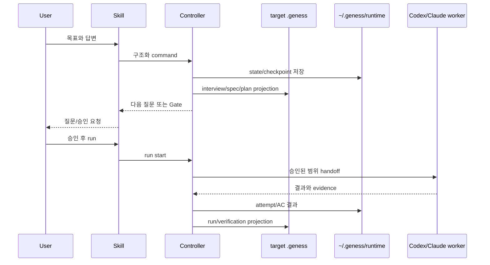

# Geness Architecture

> 상태: Proposed v1 architecture
> 권위: [Constitution](./00_GENESS.md)과 Accepted ADR 아래

## 1. 이 문서의 책임

이 문서는 Geness 구성 요소, 책임, 외부 경계와 의존 방향을 소유한다. 정확한 task
전이는 [Lifecycle](./02_TASK_LIFECYCLE.md), 저장은 [Storage](./03_STORAGE.md),
호스트 연결은 [Host Integration](./04_HOST_INTEGRATION.md)이 소유한다.

## 2. 시스템 경계

### 경계 안

- 인터뷰 coordination과 provenance
- 프로젝트·task 문서 schema와 projection
- 상태 전이, digest, Gate와 revision invalidation
- 실행 plan, checkpoint, lease와 evidence reference
- failure candidate evaluator와 memory retrieval
- 공통 CLI/MCP application service
- Codex·Claude plugin adapter

### 경계 밖

- 모델 자체의 추론 구현
- Codex·Claude host의 sandbox·승인 시스템
- Git hosting, CI와 외부 서비스의 권한 관리
- 사용자 코드를 자동 merge·push·release하는 정책
- 클라우드 동기화와 조직 계정 관리

## 3. 논리 계층

```text
Host adapters / CLI / MCP
        ↓
Application services
        ↓
Domain model and policies
        ↓
Ports
        ↓
Persistence / Runtime / Filesystem / Search adapters
```

의존 방향은 안쪽을 향한다.

- Domain은 Codex, Claude, MCP SDK, CLI parser, SQLite driver와 파일 포맷 세부사항을
  import하지 않는다.
- Application은 use case와 transaction 경계를 조율하지만 사용자 대화를 수행하지
  않는다.
- Adapter는 입력을 검증 가능한 application command로 변환하고 결과를 host 형식으로
  투영한다.
- 동일한 정책을 CLI, MCP, Skill과 hook에 중복 구현하지 않는다.

## 4. 구성 요소

### Shared Skill

- 질문과 사용자 상호작용을 조율한다.
- Core가 반환한 미결정과 상태를 사용자에게 설명한다.
- human judgment와 explicit approval을 받는다.
- host-specific tool 이름에 결합하지 않는다.

### Controller

- project/task aggregate와 revision을 관리한다.
- 상태 전이, schema, digest, lease와 completion policy를 강제한다.
- memory evaluator와 검색 budget을 적용한다.
- 한 번의 판정을 결정적으로 수행한다.

### Worker coordination

- 승인된 plan을 AC/dependency 단위 작업으로 나눈다.
- 필요한 경우 host subagent를 사용한다.
- worker의 주장을 evidence로 바꾸지 않는다.
- worker가 Controller DB에 직접 쓰지 않게 한다.

### Project document adapter

- target repository의 `.geness/`에 사람이 읽는 문서를 생성·갱신한다.
- Markdown frontmatter와 본문을 round-trip한다.
- canonical target root containment를 검증한다.

### Runtime persistence adapter

- 실행 state, attempt, lease와 evidence reference를 저장한다.
- restart와 v1 same-machine host handoff resume을 지원한다.
- 단일 writer transaction을 보장한다.

### Memory adapter

- lesson event를 append-only로 보존한다.
- SQLite/FTS5 index를 구축·재구축한다.
- exact/filter/FTS top-K 결과만 반환한다.

### Host adapters

- `.codex-plugin`과 `.claude-plugin` manifest를 제공한다.
- 각 host의 MCP, hook, session과 project root를 공통 command로 변환한다.
- mutable state를 host plugin cache에 저장하지 않는다.

## 5. Control flow



## 6. Canonical state와 projection

- 대상 task의 승인 계약은 `.geness/tasks/**/spec.md`로 사람이 읽는 portable projection을
  제공한다. contract digest, mutable state, AC verdict, evidence freshness, verifier
  provenance와 completion authority의 정본은 `runtime.sqlite3`다.
- `run.md`는 runtime state의 사람이 읽는 projection이며 raw log가 아니다.
- `verification.md`는 final verify 결과의 사람이 읽는 projection이며, 문서만으로 완료를
  선언할 수 없다.
- memory event JSONL은 lesson history의 감사 원본이다.
- memory SQLite FTS는 재구축 가능한 검색 index다.
- host session과 대화 transcript는 canonical state가 아니다.

문서와 DB가 불일치하면 digest, revision과 event lineage를 사용해 reconciliation한다.
어느 한쪽을 조용히 덮어쓰지 않는다.

v1의 host bridge는 Controller가 Codex child process에 digest·scope·AC·checkpoint를
포함한 handoff envelope를 전달하고, 결과를 다시 runtime에 기록하는 구조다. worker와
adapter는 DB를 직접 쓰지 않는다. Geness는 사용자의 current branch/worktree를 검증할
뿐 Git workspace lifecycle을 관리하지 않는다.

## 7. 원자성 경계

다음은 논리적으로 한 transaction이어야 한다.

- answer 저장과 interview revision 증가
- spec 승인과 승인 digest 기록
- contract 변경과 하위 승인/plan invalidation
- lease 획득과 run 시작 checkpoint
- attempt 결과, AC 상태와 evidence reference 연결
- lesson state transition과 evaluator event 기록
- terminal completion checkpoint와 writer lease release

프로젝트 Markdown write와 DB transaction을 완전히 원자화할 수 없으므로 operation ID,
revision과 idempotent projection으로 crash recovery한다.

## 8. 최소 package 방향

OQ-001과 [ADR-0010](./adr/0010-controller-runtime-go.md)에 따라 v1 Controller runtime은
Go와 standard Go modules를 사용한다. SQLite FTS5는 CGO와 명시적인 `sqlite_fts5` build
tag를 요구한다. macOS·Linux·Windows artifact와 exact dependency/toolchain matrix는
후속 검증 대상이며, 아래는 여전히 논리적 package 구조다.

```text
skills/              host-neutral workflow
adapters/codex/      Codex composition
adapters/claude/     Claude composition
core/domain/         entities, value objects, policies
core/application/    use cases and ports
core/infrastructure/ persistence/runtime/filesystem adapters
schemas/             documents, DB migration, MCP contracts
templates/           target .geness documents
tests/               unit, contract, integration, E2E
```

## 9. Architecture invariants

- Domain 판정은 host 없이 unit test할 수 있어야 한다.
- CLI와 MCP는 같은 application service를 호출해야 한다.
- adapter가 새로운 task 상태나 approval 의미를 만들면 안 된다.
- project identity와 workspace identity를 혼합하면 안 된다.
- runtime cleanup이 memory를 삭제하면 안 된다.
- candidate가 일반 memory query에 나타나면 안 된다.
- completion과 lesson 승격은 LLM 문자열만으로 결정하면 안 된다.
- 한 task에 동시에 두 writer가 존재하면 안 된다.

## 10. 구현 전 결정

구현 언어와 package 경계는 [ADR-0010](./adr/0010-controller-runtime-go.md)으로 Go와
Go modules를 채택했다. CLI/MCP entrypoint, daemon 여부, DB migration 도구, exact
dependency versions와 package 배포 방식은 여전히 [Open Questions](./research/OPEN_QUESTIONS.md)와
[PLAN Phase 0](./PLAN.md#phase-0-핵심-계약과-adr-확정)에서 닫는다.

## 11. Threat model and permission boundary

현재 Phase 0의 cross-concern baseline은 Accepted [ADR-0009](./adr/0009-threat-model-permission-boundaries.md)와
[OQ-015](./research/phase-0/OQ-015-threat-model-permission-policy.md)가 소유한다. C-01의
fail-closed permission boundary는 채택됐지만 일반 plan approval actor/risk tier와 production
enforcement는 OQ-008 및 후속 구현 evidence가 필요하다.

- Controller는 target-root containment, project/task identity, revision/digest, writer lease,
  allowed/forbidden scope와 completion Gate를 공통으로 판정한다.
- Host adapter, CLI/MCP, Skill, hook과 worker는 domain state·approval·completion·memory
  promotion의 별도 권위자가 아니다. worker는 runtime DB를 직접 쓰지 않는다.
- `observe`와 current approved contract/plan 아래의 `approved_local_write`를 구분한다.
  scope 확대, external write, destructive action, security boundary 변경과 permission
  escalation은 current digest에 묶인 explicit user receipt 없이는 `HOLD`한다.
- command output·environment·evidence는 persistence 또는 model context 경계 전에 redaction과
  minimization을 거친다. candidate와 corrupt memory는 optimistic success로 축약하지 않는다.

위협·control·fixture 연결표와 미해결 owner는 [OQ-015](./research/phase-0/OQ-015-threat-model-permission-policy.md#4-control-matrix-and-ownership)를
참조한다.
