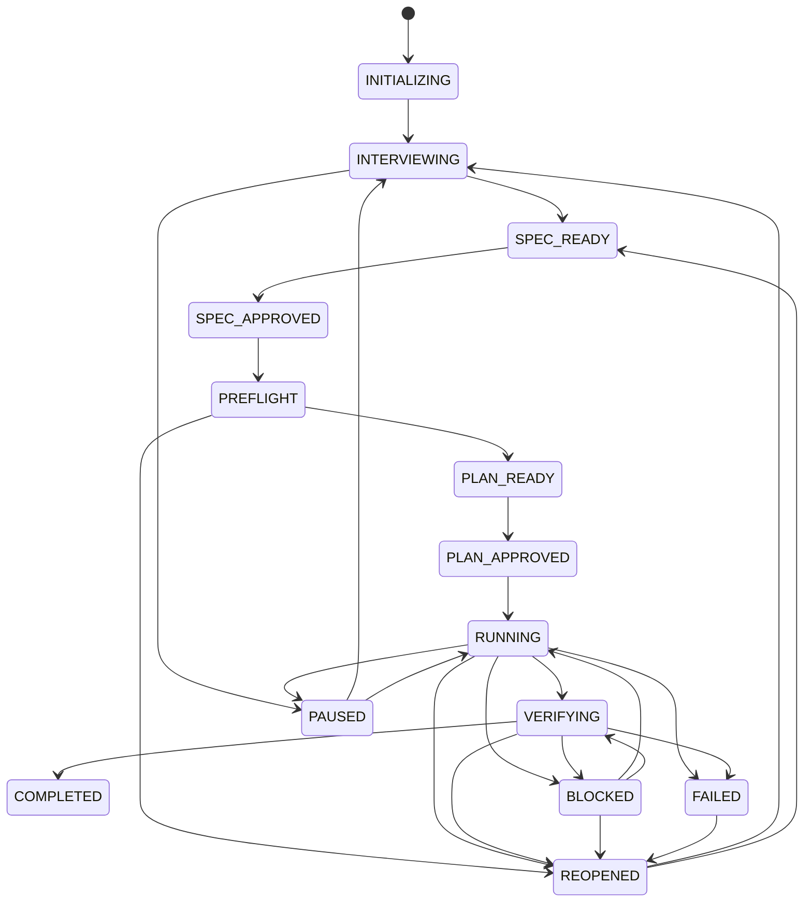

# Geness Task Lifecycle

> 상태: Proposed v1 contract

## 1. 목적

이 문서는 task 상태, Gate, backward transition, pause/resume와 completion을 정의한다.
상태의 저장 기술은 [Storage](./03_STORAGE.md), 단계별 구체 동작은 Stage Guide가
소유한다.

## 2. Canonical concepts

- `Project`: target repository의 안정적인 `project_id` 경계
- `Task`: 하나의 승인 가능한 목표와 lifecycle
- `Revision`: interview/spec/plan 의미 변경 순서
- `Run`: 승인된 contract를 실행하는 한 lineage
- `Attempt`: 한 step 또는 AC에 대한 실행 시도
- `Gate`: 다음 단계 진입 가능 여부와 blocker
- `Evidence`: AC 판정에 사용한 재현 가능한 관찰
- `Lesson candidate`: 실패에서 파생됐지만 memory로 검증되지 않은 항목

## 3. 표준 상태



개별 attempt의 `FAIL`은 task state가 아니다. 현재 v1 proposal에서 task-level
`FAILED`는 현재 run lineage를 안전하게 복구할 수 없는 system outcome을 evidence와
함께 기록하고, 사용자가 복구 또는 새 revision을 승인하면 `REOPENED`로 새 lineage를
시작한다. `CANCELLED`는 사용자 취소 결과다. 두 상태의 정확한 terminal/recovery 의미는
Phase 0의 [OQ-004](./research/OPEN_QUESTIONS.md)에서 확정한다.

## 4. Gate 공통 계약

Gate 결과는 최소한 다음을 포함한다.

```text
decision: CLEAR | HOLD
state/revision
reasons[]
required_actions[]
evidence_refs[]
evaluated_at
policy_version
```

- `CLEAR`는 다음 단계 진입 조건을 evidence로 충족했다는 뜻이다.
- `HOLD`는 transport error가 아니라 정상적인 도메인 결과다.
- Gate는 자신이 평가한 revision에 묶인다.
- 새 revision이 생기면 이전 Gate를 재사용하지 않는다.
- 사용자의 승인이 필요한 조건을 에이전트가 대신 충족할 수 없다.

## 5. 단계별 entry/exit

사용자-facing stage는 내부 상태를 대체하지 않는 public alias다.

| Public stage | Canonical state 또는 의미 |
| --- | --- |
| `brief` | `INTERVIEWING` |
| `contract` | `SPEC_READY → SPEC_APPROVED` |
| `plan` | `PREFLIGHT → PLAN_READY → PLAN_APPROVED` |
| `impl` | `RUNNING` |
| `verify` | `VERIFYING` |
| `done` | Controller completion transaction으로 `COMPLETED` 노출 |
| `resume` | `PAUSED`, `BLOCKED`, `REOPENED`에서 재개하는 action |
| `setup` | task 이전 project/workspace readiness |

`gee` router와 compact status report는 public 이름을 사용하고, Controller와 runtime DB는
canonical state를 기록한다. `done`과 `resume`은 새로운 task state가 아니다.

| 단계 | Entry | Exit |
| --- | --- | --- |
| Interview | project/task 초기화 | closure audit 통과, restatement 승인 |
| Specification | 승인 가능한 interview revision | schema·AC 검증, explicit approval, digest |
| Preflight/Plan | 승인된 spec | 실제 repository 점검, 추적 가능한 plan, 필요 승인 |
| Execution | 승인된 digest와 writer lease | 모든 work item 종료 또는 typed blocker |
| Verification | 실행 lineage와 evidence | 모든 필수 AC pass 또는 recovery/reopen route |
| Learning | 실패·성공 event | deterministic lifecycle transition |

`PLAN_APPROVED`는 항상 Plan Gate가 통과했다는 상태 이름이다. 반드시 사람이 승인했다는
뜻은 아니다. Gate에는 `approval_actor: user | policy`를 기록한다. scope 확대, 파괴적
행동, 외부 쓰기와 고위험 변경은 `user`만 가능하다. 일반 plan을 어떤 policy가 승인할
수 있는지는 Phase 0의 [OQ-008](./research/OPEN_QUESTIONS.md)이 닫히기 전까지 HOLD다.

## 6. Invalidation

- Goal, non-goals, constraints, context, AC 또는 execution policy가 바뀌면 spec approval을
  무효화한다.
- Spec digest가 바뀌면 plan과 아직 끝나지 않은 run을 stale로 표시한다.
- Editorial change와 semantic change의 canonicalization 규칙은 Phase 0에서 확정한다.
- 실행 중 잘못된 가정이 contract에 영향을 주면 `REOPENED`로 돌아간다.
- 구현 방법만 바뀌고 contract가 같으면 plan/run revision만 갱신할 수 있다.

## 7. Pause, block, resume

- `PAUSED`는 사용자가 재개할 수 있는 의도적 중단이다.
- `BLOCKED`는 필요한 authority, dependency, evidence 또는 결정이 없는 상태다.
- blocker에는 category, owner, 필요한 action과 마지막 evidence가 있어야 한다.
- resume는 마지막 checkpoint, 현재 Git 상태와 digest를 재검증한다.
- host session ID가 없어도 resume할 수 있어야 한다.
- `BLOCKED → VERIFYING`은 구현 수정 없이 누락 evidence/dependency만 해소된 경우에만
  허용한다. contract가 바뀌면 반드시 `REOPENED`로 간다.
- verify의 수정 가능한 실패는 현재 contract와 AC를 유지하는 successor attempt로
  재개할 수 있다. task당 successor는 최대 5회이며, 반복 fingerprint·진전 없음·예산
  소진은 `BLOCKED`와 사용자 attention으로 끝낸다.
- v1 resume은 같은 컴퓨터·같은 `GENESS_HOME`·사용자가 준비한 같은 branch/worktree에서만
  지원한다. Geness는 checkout, worktree 생성·삭제·전환을 수행하지 않는다.

## 8. Writer lease

- key는 최소 `project_id + task_id`다.
- owner는 workspace, host와 process/session reference를 포함한다.
- heartbeat 부재만으로 즉시 takeover하지 않는다.
- grace period와 마지막 checkpoint 검증 후 명시적으로 takeover한다.
- observer는 state와 evidence를 읽을 수 있지만 mutation을 수행하지 않는다.

## 9. Completion

`COMPLETED`는 [Verification](./08_VERIFICATION.md)의 completion Gate만 선언할 수
있다. 다음 조건이 모두 필요하다.

- 승인 digest 일치
- 필수 AC 전부 pass
- AC별 evidence reference
- 승인되지 않은 scope drift 없음
- 열린 blocker 없음
- run summary와 checkpoint 동기화
- final `verification.md` projection과 runtime verdict 동기화
- 독립 verification 결과
- completion commit에서 writer lease가 원자적으로 해제됨

완료 순서는 다음과 같다.

1. verification이 current digest의 `READY_TO_COMPLETE` Gate를 만든다.
2. Controller가 final `run.md` projection과 reconciliation을 완료한다.
3. 한 runtime transaction에서 terminal checkpoint를 기록하고 writer lease를 해제한다.
4. active lease가 없고 terminal checkpoint를 읽을 수 있을 때만 `COMPLETED`를 외부에
   노출한다.

3번 전후 crash는 operation ID로 idempotent하게 reconciliation한다. 정확한 SQLite
schema와 transaction 구현은 Phase 0에서 확정한다.

## 10. 금지된 전이

- `INTERVIEWING → RUNNING`
- `SPEC_READY → RUNNING`
- stale digest를 가진 `PLAN_APPROVED → RUNNING`
- evidence 없이 `VERIFYING → COMPLETED`
- candidate 생성만으로 lesson을 `verified`로 전환
- 자동 재시도 budget 소진 후 같은 전략으로 계속 실행

## 11. 최소 테스트 시나리오

- 정상 success path
- closure blocker가 있는 interview HOLD
- 승인 후 semantic spec 변경과 하위 invalidation
- preflight에서 잘못된 가정을 찾아 reopen
- 두 writer lease 경쟁
- host A 중단 후 host B safe takeover
- AC 일부 pass, 일부 fail인 verification HOLD
- scope change를 요구하는 failure의 user reapproval
- BLOCKED에서 evidence-only VERIFYING 복귀와 contract-change REOPENED 분기
- task-level FAILED 후 명시적 reopen
- cancelled task와 expired lease 구분
