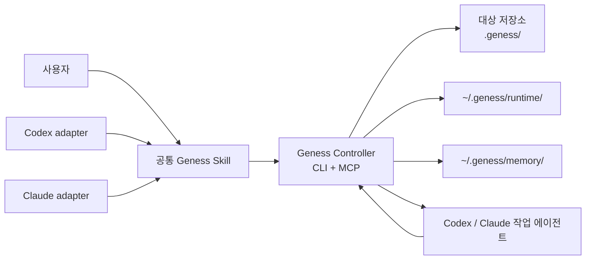

# Geness 구현 계획

> 상태: Draft
> 작성일: 2026-08-10
> 저장소: `claude-studio/geness`
> 제품 구현 상태: 시작 전
> 문서 foundation: 완료

## 1. 문서 목적

이 문서는 Geness의 제품 경계, 저장 구조, 상태 머신, 구현 순서 및 완료 조건을 정의하는 현재 계획의 정본이다.

Geness는 Ouroboros 전체를 복제하지 않는다. 사용자의 암묵지를 반복 질문으로 드러내고, 승인된 문서를 실행 계약으로 사용하며, 실제 검증이 끝날 때까지 작업을 재개할 수 있는 경험만 경량화해 제공한다.

```text
인터뷰
→ 명세 승인
→ 실행 전 점검
→ AC 및 계획 확정
→ 실행
→ 검증
→ 완료
→ 실패 교훈 평가
```

Geness는 단일 문서 생성 스킬이 아니라 다음 요소를 함께 배포하는 상태 기반 플러그인이다.

- Codex와 Claude Code에서 공통으로 사용하는 Skill
- 인터뷰·승인·실행·검증 상태를 관리하는 Controller
- 공통 CLI 및 MCP 도구
- 대상 저장소에 생성되는 프로젝트 문서
- 사용자 로컬의 runtime 및 memory 저장소
- Codex와 Claude Code 각각의 얇은 설치·실행 어댑터

### 1.1 설계 출처와 독립성

Geness의 인터뷰 경험은
[`Q00/ouroboros`](https://github.com/Q00/ouroboros/tree/25f958dd7938d3c383ccfd14d551467bcf6e6bd6)의
Socratic interview와 specification-first workflow를 참고했다. 질문과 실행 역할 분리,
사실과 사용자 결정의 provenance, 답변 refine, closure/restate/approval Gate와 승인된
사양을 실행 계약으로 쓰는 원칙을 설계 입력으로 삼았다.

Geness는 Ouroboros를 포팅하거나 호환 구현하지 않는다. Seed, ontology, model routing,
EventStore와 전체 evolution loop는 Geness 계약이 아니다. 문서 형식, 상태 모델, 저장
경계와 실패 학습 알고리즘은 독립 사양으로 정의한다. 정확한 채택·변형·비채택 범위와
MIT 라이선스 처리는
[Ouroboros Reference Findings](./research/OUROBOROS_REFERENCE_FINDINGS.md)가 소유한다.

Geness 자체의 docs-first 개발 방식은
[`FRONT-JB/mcx`](https://github.com/FRONT-JB/mcx/tree/c49d2493f94fba6928ed20a46c9db8aecdcd3087/docs)의
문서 소유권 구조를 참고했다. 적용 차이는
[MCX Reference Findings](./research/MCX_REFERENCE_FINDINGS.md)에 기록한다.

## 2. 목표

### 2.1 제품 목표

- 한 번의 입력으로 문서를 바로 생성하지 않고, 중요한 미결정이 닫힐 때까지 사용자에게 계속 질문한다.
- 코드에서 확인 가능한 사실과 사용자가 결정해야 할 판단을 구분한다.
- 목표, 범위, 예외, 실패 동작과 검증 방법을 명시적으로 결정한다.
- 인터뷰 결과를 대상 저장소의 재개 가능한 문서로 남긴다.
- 승인된 명세를 검증 가능한 Acceptance Criteria와 실행 계획으로 변환한다.
- Codex 또는 Claude Code에서 실행을 시작하고, 중단 후 다른 호스트에서도 이어갈 수 있게 한다.
- 모든 필수 AC에 증거가 연결되기 전에는 작업을 완료 처리하지 않는다.
- 실행 중 발견된 잘못된 가정을 기록하되, 알고리즘을 통과한 교훈만 장기 기억으로 승격한다.
- 관련 기억만 짧게 조회하여 속도와 컨텍스트 토큰을 보호한다.

### 2.2 성공 기준

- 동일한 Geness 패키지를 Codex와 Claude Code에 설치할 수 있다.
- 두 호스트가 동일한 프로젝트 ID, task 문서, 상태 전이와 DB를 사용한다.
- 대상 저장소에 `.geness/project.json`과 `.geness/tasks/**`가 생성된다.
- 인터뷰가 차단 미결정과 모순을 남긴 채 자동 종료되지 않는다.
- 승인된 계약이 변경되면 기존 승인이 자동으로 무효화된다.
- 실행 중단 후 체크포인트에서 안전하게 재개할 수 있다.
- 모든 AC가 검증돼야 `COMPLETED`가 된다.
- 일회성 실패는 장기 기억으로 자동 주입되지 않는다.
- memory 검색은 구조 필터와 FTS 상위 결과만 반환한다.

## 3. 비목표

초기 버전에서는 다음을 구현하지 않는다.

- Ouroboros의 ontology, evolution, event-store 전체 복제
- PM 인터뷰와 개발 인터뷰를 나누는 이중 파이프라인
- 중앙 클라우드 서비스 또는 계정 간 자동 동기화
- 웹 GUI나 별도 데스크톱 애플리케이션
- vector DB 또는 embedding 기반 검색
- 사용자 승인 없는 Git commit, push, PR 생성
- 사용자 승인 없는 요구사항·AC 변경
- 무제한 background daemon 또는 무한 재시도
- 저장소 밖 임의 경로에 대한 자동 수정
- 원본 로그나 비밀정보의 Git 커밋

## 4. 확정된 결정

- [x] 플러그인 이름은 `geness`다.
- [x] 이 저장소가 Geness 플러그인의 소스 루트다.
- [x] 하나의 소스 저장소에서 Codex와 Claude Code를 함께 지원한다.
- [x] 공통 기능은 하나의 Controller와 상태 머신으로 구현한다.
- [x] 호스트별 매니페스트와 필요한 어댑터만 분리한다.
- [x] 프로젝트 문서는 Geness 설치 경로가 아니라 실제 작업 대상 저장소에 생성한다.
- [x] 대상 저장소의 Geness 루트는 `.geness/`다.
- [x] 프로젝트 식별 파일은 `.geness/project.json`이다.
- [x] task 문서는 `.geness/tasks/<task-slug>--<task-id>/`에 둔다.
- [x] 사용자 로컬 데이터 루트는 기본적으로 `~/.geness/`다.
- [x] 사용자 로컬 하위 이름은 `memory/`와 `runtime/`을 사용한다.
- [x] 저장소 폴더명만 프로젝트 식별자로 사용하지 않는다.
- [x] 프로젝트는 `project_id`, clone/worktree 실행 환경은 `workspace_id`로 구분한다.
- [x] 사람이 읽고 Git으로 공유하는 계약 정본은 대상 저장소의 Markdown 문서다.
- [x] DB, 원본 로그, 잠금, lease와 대용량 증거는 `~/.geness/`에 둔다.
- [x] `memory.sqlite3`와 `runtime.sqlite3`의 수명과 책임을 분리한다.
- [x] 실패를 발견했다고 바로 장기 기억으로 주입하지 않는다.
- [x] 장기 기억 승격·감쇠·만료는 LLM의 자유 판단이 아닌 이벤트와 규칙으로 결정한다.

## 5. 핵심 원칙

### 5.1 공통 코어, 얇은 호스트 어댑터

Skill과 호스트별 hook은 사용자 경험을 연결한다. 프로젝트 ID, 상태 전이, 승인 digest, AC 검증, lease와 기억 lifecycle의 권위자는 공통 Controller다.

### 5.2 사실과 판단을 분리한다

- 코드·설정·테스트에서 정확히 확인되는 사실은 Geness가 조사한다.
- 선호, 우선순위, 새로운 동작, 허용 가능한 위험은 사용자가 결정한다.
- 코드 사실을 사용자 요구사항으로 자동 승격하지 않는다.
- 모든 답변에는 `from-user`, `from-code`, `from-research` 등의 provenance를 남긴다.

### 5.3 문서와 런타임 상태를 분리한다

- 대상 저장소의 `.geness/`: 사람이 검토하고 Git으로 공유할 계약과 실행 요약
- 사용자 홈의 `~/.geness/runtime/`: 변경 가능한 실행 상태와 원본 증거
- 사용자 홈의 `~/.geness/memory/`: 검증된 교훈과 빠른 검색 인덱스
- 플러그인 설치 폴더: 읽기 전용 코드, Skill, schema와 template

### 5.4 완료는 증거로 판정한다

질문 횟수, LLM의 자신감 또는 구현 종료 메시지는 완료 근거가 아니다. 모든 필수 AC가 통과하고 각 AC에 증거가 연결돼야 완료된다.

### 5.5 실패는 기억 후보일 뿐이다

실패 원본은 먼저 runtime에 저장한다. 반복성, 인과관계 또는 guard 효과가 입증된 항목만 memory로 승격한다.

### 5.6 필요한 기억만 지연 로딩한다

전체 memory나 evidence를 프롬프트에 넣지 않는다. 정확한 fingerprint, 구조 필터, FTS 순으로 좁힌 소수의 요약만 전달하고, 선택된 증거만 추가로 읽는다.

## 6. 전체 구조



역할은 다음과 같다.

| 구성 요소 | 책임 |
| --- | --- |
| 공통 Skill | 반복 질문, 답변 정제, 사용자 승인 UX |
| Codex adapter | Codex 매니페스트, MCP·hook 연결, 호스트 정보 전달 |
| Claude adapter | Claude 매니페스트, MCP·hook 연결, 호스트 정보 전달 |
| Controller | 상태 머신, schema 검증, digest, lease, 체크포인트, 기억 알고리즘 |
| 작업 에이전트 | 승인된 범위에서 코드 조사·수정·검증 수행 |
| 프로젝트 문서 | 인터뷰·승인 계약·계획과 실행 요약의 휴대 가능한 문서 |
| runtime DB | 현재 실행의 재개, 동시성, 시도 및 원본 실패 |
| memory DB | 검증된 교훈의 구조 검색과 FTS 검색 |

## 7. 플러그인 저장소 구조

목표 구조는 다음과 같다. 구현 언어와 패키지 도구가 결정되면 언어별 디렉터리를 구체화한다.

```text
geness/
├── .codex-plugin/
│   └── plugin.json
├── .claude-plugin/
│   └── plugin.json
├── skills/
│   └── workflow/
│       ├── SKILL.md
│       └── references/
├── adapters/
│   ├── codex/
│   │   ├── mcp.json
│   │   └── hooks.json
│   └── claude/
│       ├── mcp.json
│       └── hooks.json
├── core/
│   ├── project/
│   ├── interview/
│   ├── specification/
│   ├── planning/
│   ├── execution/
│   ├── verification/
│   └── memory/
├── schemas/
├── templates/
├── bin/
│   └── geness
├── tests/
├── AGENTS.md
├── CLAUDE.md -> AGENTS.md
└── docs/
    ├── README.md
    ├── 00_GENESS.md
    ├── 01_ARCHITECTURE.md
    ├── 02_TASK_LIFECYCLE.md
    ├── 03_STORAGE.md
    ├── 04_HOST_INTEGRATION.md
    ├── 05_INTERVIEW.md
    ├── 06_SPECIFICATION.md
    ├── 07_EXECUTION.md
    ├── 08_VERIFICATION.md
    ├── 09_LEARNING.md
    ├── PLAN.md
    ├── adr/
    ├── progress/
    └── research/
```

호스트별 파일에는 공통 비즈니스 규칙을 중복하지 않는다. 두 매니페스트는 동일한 plugin name과 version을 사용하고, 빌드 또는 검증 과정에서 불일치를 차단한다.

문서별 소유권, 읽는 순서와 HOLD/CLEAR 규칙은 [문서 안내](./README.md)가 소유한다.
PLAN은 미래 구현과 완료 조건이고, 실제 현재 상태는
[Progress](./progress/README.md)가 소유한다.

## 8. 대상 저장소 구조

Geness를 사용하는 실제 대상 저장소에는 다음 구조를 생성한다.

```text
<target-repository>/
└── .geness/
    ├── project.json
    ├── config.yaml                 # 포함 여부는 Phase 0에서 결정
    └── tasks/
        └── <task-slug>--<task-id>/
            ├── interview.md
            ├── spec.md
            ├── plan.md
            └── run.md
```

### 8.1 `project.json`

최소 계약은 다음과 같다.

```json
{
  "schema_version": 1,
  "project_id": "<stable-id>",
  "display_name": "<repository-name>",
  "created_at": "<RFC3339>"
}
```

- `project_id`는 폴더명과 독립적인 안정 ID다.
- `display_name`은 경로와 UI에 사용하는 사람이 읽을 수 있는 이름이다.
- clone과 fork에서 ID를 공유할지 여부는 Phase 0 결정 항목이다.
- `workspace_id`는 사용자 로컬에서 현재 clone/worktree를 구분하며 프로젝트 문서의 정체성으로 사용하지 않는다.

### 8.2 대상 루트 결정 규칙

1. 사용자가 명시한 project root가 있으면 우선한다.
2. 현재 위치부터 상위로 `.geness/project.json`을 찾는다.
3. 없으면 Git top-level을 후보로 사용한다.
4. 후보가 여러 개이거나 Git root가 없으면 사용자에게 선택을 요청한다.
5. 초기화 승인을 받은 뒤에만 `.geness/`를 생성한다.
6. 모든 출력 경로가 확정된 target root 내부인지 canonical path로 검증한다.
7. 플러그인 설치·cache 디렉터리를 target으로 추론하지 않는다.

### 8.3 task 문서

#### `interview.md`

- 최초 요청과 초기 문맥
- 코드·문서에서 확인한 사실과 출처
- 질문과 원본 답변
- 정제된 결정, 이유, 제약, 범위 밖
- 가정, 반례와 예외
- 변경·폐기된 결정과 superseded 관계
- 모순과 미결정 ledger
- closure audit 결과

#### `spec.md`

- 해결할 문제와 기대 결과
- 목표와 비목표
- 사용자 관점 동작과 도메인 규칙
- 제약 및 관련 코드 문맥
- Acceptance Criteria
- 실행 허용 범위와 테스트 정책
- 미결정 또는 명시적으로 미룬 항목
- 승인자, 승인 시각과 contract digest

#### `plan.md`

- 실행 전 점검 결과
- 요구사항과 AC 추적 관계
- AC별 구현 단계와 의존성
- 변경 예상 파일 및 경계
- 테스트·검증 방식
- 증거 생성 방법
- 위험, 중단 및 재계획 조건
- 승인 정보가 필요할 경우 plan digest

#### `run.md`

- run ID와 사용한 spec/plan digest
- 시작·종료 시각과 실행 호스트
- AC별 상태와 검증 요약
- 시도별 결과와 중요한 변경
- 증거 ID, 경로 및 해시
- 계획 이탈, 재계획과 재승인 이력
- 차단 사유 또는 최종 완료 상태

원본 명령 출력, 비밀정보 또는 대용량 evidence는 프로젝트 문서에 넣지 않는다. `run.md`에는 정제된 요약과 로컬 evidence reference만 남긴다.

## 9. 사용자 로컬 데이터 구조

기본 경로는 `GENESS_HOME`으로 재정의할 수 있고, 미설정 시 `~/.geness/`를 사용한다.

```text
~/.geness/
├── memory/
│   └── <repo-slug>--<project-id>/
│       ├── events.jsonl
│       └── memory.sqlite3
└── runtime/
    └── <repo-slug>--<project-id>/
        └── <workspace-id>/
            ├── runtime.sqlite3
            ├── locks/
            ├── logs/
            └── evidence/
```

`repo-slug`는 가독성을 위한 값이고 식별 권위는 `project_id`다.

### 9.1 `runtime.sqlite3`

현재 실행을 안전하게 중단·복구·재개하기 위한 mutable 상태 저장소다.

최소 저장 대상:

- run ID와 task ID
- task 상태와 다음 허용 전이
- 승인된 spec 및 plan digest
- AC별 상태, 시도 횟수와 마지막 결과
- 실행 host와 host session reference
- project ID와 workspace ID
- writer lease, owner와 heartbeat
- 실행 step과 checkpoint
- 명령·로그·evidence reference와 해시
- 실패 fingerprint 및 lesson candidate
- 재계획·재승인 이력

원본 로그와 evidence blob은 파일로 저장하고 DB에는 메타데이터, 경로와 해시만 둔다. 완료된 runtime은 보존 정책에 따라 정리할 수 있다.

### 9.2 `memory.sqlite3`

관련 작업을 시작할 때 과거의 검증된 교훈을 짧고 빠르게 찾는 검색 저장소다.

최소 저장 대상:

- lesson ID와 lifecycle 상태
- project, module, file, symbol 및 task type scope
- trigger와 fingerprint
- wrong assumption
- actual rule
- root cause
- proposed 또는 verified guard
- 발생 횟수와 독립 run 수
- eligible exposure와 unassisted success 수
- guard가 예방한 횟수
- 마지막 발생·조회 시각
- evidence reference와 해시
- 검색용 짧은 요약

`events.jsonl`은 lesson의 생성·병합·승격·만료를 append-only로 보존하는 감사 및 재구축 원본이다. SQLite/FTS5는 구조 필터, 순위, 결과 제한과 짧은 snippet을 위한 인덱스다.

두 DB를 분리하는 이유는 다음과 같다.

- runtime을 TTL로 삭제해도 장기 기억은 유지된다.
- memory 검색이 실행 로그 테이블의 크기에 영향을 받지 않는다.
- 백업·migration·권한과 보존 정책을 독립적으로 적용할 수 있다.
- 일시적 실패가 장기 기억 검색에 섞이는 것을 구조적으로 차단한다.

## 10. task 상태 머신

권장 상태는 다음과 같다.

```text
INITIALIZING
→ INTERVIEWING
→ SPEC_READY
→ SPEC_APPROVED
→ PREFLIGHT
→ PLAN_READY
→ PLAN_APPROVED
→ RUNNING
→ VERIFYING
→ COMPLETED
```

Happy path 밖의 상태 후보:

```text
PAUSED
BLOCKED
REOPENED
FAILED
CANCELLED
```

`FAILED`와 `CANCELLED`의 정확한 terminal/recovery 의미는 Phase 0 상태 전이 결정에서
확정한다. 현재 목록에 있다는 사실만으로 자동 복구 또는 영구 종료를 추론하지 않는다.

핵심 규칙:

- 승인 전에는 실행할 수 없다.
- 승인 후 contract digest가 바뀌면 승인을 무효화하고 `REOPENED`로 전환한다.
- 실행 전 점검으로 가정이 틀렸음이 밝혀지면 인터뷰 또는 명세 단계로 돌아간다.
- 실행 중 기대 동작, 범위 또는 AC를 바꿔야 하면 사용자 재승인을 요구한다.
- 구현 방법만 바뀌고 계약에 영향이 없으면 plan 이력과 runtime checkpoint만 갱신한다.
- 두 호스트가 동일 task의 writer가 될 수 없다.
- 모든 필수 AC와 evidence가 충족돼야 `COMPLETED`로 전환한다.
- 반복 실패, 권한 부족, 외부 의존성 등의 중단은 typed `BLOCKED` reason으로 기록한다.
- `PLAN_APPROVED`는 Plan Gate 통과를 뜻한다. actor는 `user | policy`로 기록하며,
  일반 plan의 policy 승인 범위는 Phase 0 결정 전까지 사용자 승인을 생략하지 않는다.

## 11. 인터뷰 설계

### 11.1 역할 분리

- 공통 인터뷰 엔진: 다음에 닫아야 할 가장 큰 미결정을 선택한다.
- 메인 호스트 세션: 코드 조사, 답변 routing과 사용자 대화를 담당한다.
- 사용자: 판단, 선호, 범위, trade-off와 승인 결정을 내린다.
- 조사 subagent: 코드 사실 또는 필요한 외부 사실을 독립적으로 확인한다.

### 11.2 질문 정책

- 한 번에 영향이 가장 큰 미결정 하나를 질문한다.
- 질문 전에 코드·문서·설정에서 확인할 수 있는 내용을 먼저 조사한다.
- 코드 사실을 다시 묻지 않되, 그 사실이 원하는 동작인지 여부는 사용자에게 확인한다.
- 답변에 따라 다음 질문과 ledger를 다시 계산한다.
- 정상 흐름뿐 아니라 반례, 실패 동작, 경계 조건과 비목표를 확인한다.
- 앞선 결정이나 코드 근거와 충돌하면 자동 해석하지 않고 correction 질문으로 되돌린다.
- 질문 횟수 상한이나 LLM의 모호도 점수만으로 인터뷰를 종료하지 않는다.
- non-user fact answer가 세 번 연속되면 미해결 사용자 판단을 반드시 다음에 묻는다.
- 한 gap 유형을 최대 세 번 다룬 뒤 전체 ledger breadth를 다시 점검한다.
- closure Gate 통과 뒤 계약을 바꾸지 않는 wording/극단 edge case만으로 과잉 질문하지
  않는다.
- exact manifest/config literal만 자동 확인하고, code intent 추론은 사용자에게 확인한다.

### 11.3 답변 provenance 및 정제

각 답변은 다음 origin 중 하나 이상을 가진다.

```text
from-user
from-code
from-research
```

자유 서술 답변은 다음 구조로 정제한다.

```text
Decision
Reasoning
Constraints
Out of scope
Codebase context
```

사용자 답변을 정제한 경우, 의미가 빠지거나 왜곡되지 않았는지 사용자에게 확인한 뒤 decision으로 잠근다. 결정 수정은 기존 기록을 삭제하지 않고 `superseded_by` 관계로 남긴다.

### 11.4 인터뷰 ledger

최소 ledger는 다음을 추적한다.

- scope와 non-goals
- constraints와 code context
- expected outputs와 failure behavior
- acceptance 및 verification
- assumptions
- contradictions
- open questions와 deferred decisions

### 11.5 인터뷰 종료 게이트

다음 조건을 모두 충족해야 `SPEC_READY`가 될 수 있다.

- 차단 상태 open question이 0개다.
- 결정 간 unresolved contradiction이 0개다.
- 목표, 범위, 비목표, 예외와 실패 동작이 문서화됐다.
- 중요한 가정에 코드 근거 또는 사용자 확인이 있다.
- 모든 요구사항을 검증 가능한 결과 상태로 바꿀 수 있다.
- closer 관점에서 명세를 만들 정보가 충분하다.
- contrarian 관점에서 HIGH severity 반례가 남지 않는다.
- gap-hunter 관점에서 HIGH severity 누락이 남지 않는다.
- 합의 목표를 한 문장으로 restate하고 사용자가 명시적으로 승인했다.

숫자 기반 ambiguity score는 보조 신호로 도입할 수 있지만 승인 권위자로 사용하지 않는다.
Restatement가 수정되면 답변 refine부터 다시 확인하고 interview를 reopen한 뒤 현재
revision으로 closure audit을 재실행한다. 이 승인은 interview 이해 확인이며 이후
`spec.md` digest의 명시적 승인을 대신하지 않는다.

## 12. 명세와 AC 계약

`spec.md`는 Markdown 본문과 machine-readable frontmatter를 함께 사용하는 방향을 우선 검토한다.

예시:

```yaml
---
schema_version: 1
task_id: task-01J...
status: approved
source_interview_id: interview-01J...
contract_digest: sha256:...
approval:
  approved_at: 2026-08-10T12:00:00+09:00
  approved_by: user
goal: 사용자가 볼 수 있는 완료 상태
non_goals: []
constraints: []
context:
  cwd: .
  relevant_paths: []
acceptance_criteria:
  - id: AC-001
    outcome: 완료된 결과 상태
    verify: 단일 행 검증 명령 또는 null
    manual_check: 명령으로 검증할 수 없을 때의 절차 또는 null
    artifacts:
      - workspace-relative/exact/path
    expect: stdout/stderr literal 또는 관찰 가능한 결과
open_questions: []
execution:
  allowed_scope: []
  test_policy: 프로젝트 정책
completion_policy: all_required_acceptance_criteria_verified
---
```

AC 작성 규칙:

- 최소 한 개 이상의 AC가 있어야 한다.
- AC는 구현 단계가 아니라 완료된 결과 상태를 기술한다.
- 각 AC에는 자동 검증 명령 또는 명시적인 수동 검증 절차가 있어야 한다.
- artifact 경로는 target root 기준의 정확한 상대 경로다.
- `expect`는 판정 가능한 literal, pattern 또는 관찰 조건이다.
- 모든 요구사항은 하나 이상의 AC에 연결된다.
- 하나의 AC가 지나치게 많은 독립 결과를 묶지 않는다.

### 12.1 승인 digest

- digest는 goal, non-goals, constraints, relevant context, AC 및 execution policy를 canonical serialization한 값의 SHA-256으로 계산한다.
- status, 실행 시각, run 결과처럼 변하는 필드는 contract digest에서 제외한다.
- 해시 대상 필드가 바뀌면 승인과 하위 plan을 무효화한다.
- 승인 receipt와 digest는 `spec.md` 및 runtime DB 양쪽에 기록한다.
- 사용자 승인을 받지 않은 silent rewrite를 허용하지 않는다.

## 13. 실행 전 점검과 계획

명세 승인 후, 실제 실행 계획을 확정하기 전에 다음을 점검한다.

- 실제 Git root와 `.geness/project.json`
- branch, worktree와 기존 dirty state
- 명세가 언급한 파일, symbol, 데이터 구조와 기존 테스트
- 빌드·테스트·lint 명령의 실제 존재 여부
- 권한, 외부 서비스, 네트워크와 환경 제약
- 계획이 변경할 파일과 허용 범위의 일치 여부
- 코드 근거 없이 작성된 가정
- 관련 verified/enforced memory 상위 결과

잘못된 가정이 발견되면 AC를 억지로 수정하지 않고 명세 또는 인터뷰를 다시 연다.

계획 종료 게이트:

- 모든 명세 요구사항이 AC에 연결된다.
- 모든 AC에 구현 step과 검증 방식이 연결된다.
- 실행 순서와 의존성이 정해졌다.
- 검증 명령 또는 수동 evidence 절차가 실제로 실행 가능하다.
- 중단 및 재계획 조건이 정의됐다.
- 차단 미결정이 0개다.
- Plan Gate가 통과했고 `approval_actor: user | policy` receipt와 필요한 digest가 있다.
- policy 승인 범위가 확정되기 전이거나 고위험·scope 확대 작업이면 명시적 사용자
  승인이 있다.

## 14. 실행·검증·재개

### 14.1 실행 시작

1. project ID, workspace ID와 task ID를 확인한다.
2. 승인된 spec/plan digest를 다시 계산한다.
3. schema와 state transition을 검증한다.
4. `project_id + task_id` writer lease를 획득한다.
5. dirty state와 실행 환경 snapshot을 기록한다.
6. 관련 memory를 제한적으로 조회한다.
7. 첫 checkpoint를 저장한 뒤 실행한다.

### 14.2 실행 규칙

- AC와 dependency 단위로 작업을 분해한다.
- 독립적인 조사·구현·검증은 subagent로 병렬화할 수 있다.
- 승인된 요구사항을 작업 에이전트가 조용히 변경할 수 없다.
- 각 시도에 입력 contract, 변경, 명령, 결과 및 evidence를 연결한다.
- 같은 실패 fingerprint가 반복되면 무한 재시도하지 않고 재계획 또는 `BLOCKED`로 전환한다.
- 외부 쓰기, 위험한 명령 또는 allowed scope 확대는 별도 승인을 요구한다.
- 특정 Codex/Claude 대화 기록만을 복구 수단으로 사용하지 않는다.

### 14.3 잘못된 가정을 발견한 경우

1. 현재 attempt를 실패 또는 중단으로 기록한다.
2. 코드·테스트·명령 출력 등 실제 근거를 evidence로 저장한다.
3. 실패 fingerprint와 lesson candidate를 생성한다.
4. spec 또는 AC에 미치는 영향을 판정한다.
5. 계약 영향이 있으면 `REOPENED`로 전환하고 해당 문서를 갱신한다.
6. 필요한 사용자 결정을 다시 질문한다.
7. 새 digest를 승인받은 뒤 재계획하고 실행한다.

### 14.4 호스트 간 재개

- host session ID는 참고 메타데이터일 뿐 portable state가 아니다.
- Controller checkpoint는 mutable 실행 상태의 정본이고 `.geness/tasks/**`는 portable
  계약과 사람이 읽는 projection이다. 둘은 revision/digest로 reconciliation한다.
- 한 호스트가 writer인 동안 다른 호스트는 observer로 상태를 조회할 수 있다.
- heartbeat가 끊긴 lease는 grace period 후 명시적인 takeover 절차로만 회수한다.
- takeover 시 마지막 checkpoint, Git 상태와 실행 중이던 process를 재검증한다.

### 14.5 완료 게이트

- 모든 필수 AC가 통과했다.
- 각 AC에 검증 evidence가 연결됐다.
- 승인되지 않은 범위 변경이 없다.
- 프로젝트 문서와 실제 코드 상태가 일치한다.
- 열린 blocker가 없다.
- 독립 검증자가 완료 판정을 재확인했다.
- `run.md`에 최종 상태와 evidence 요약이 기록됐다.
- final `run.md`가 reconcile된 뒤 한 runtime completion transaction에서 terminal
  checkpoint가 기록되고 writer lease가 해제됐다.

## 15. 실패 교훈 lifecycle

### 15.1 상태

```text
runtime candidate
→ probationary
→ verified
→ enforced
→ compiled
```

종료 상태:

```text
expired
rejected
superseded
deprecated
```

- `candidate`: 실행에서 관찰한 원본 실패다. runtime에만 있고 일반 프롬프트에 주입하지 않는다.
- `probationary`: 동일 trigger의 후속 실행을 측정하는 평가 대상이다.
- `verified`: 반복 또는 재현 가능한 인과 근거가 확인된 장기 기억이다.
- `enforced`: 관련 작업에서 반드시 확인할 guard다.
- `compiled`: 테스트, lint, type, schema 또는 코드 제약으로 자동화돼 프롬프트 주입이 불필요하다.
- `expired`: 관련 상황에서 가치가 낮아져 일반 검색에서 제외한다.

### 15.2 lesson candidate 예시

```yaml
id: LESSON-017
status: candidate
scope:
  project: current
  modules:
    - payment
  task_types:
    - retry
    - failure-counter
trigger: 결제 실패를 집계하거나 재시도 정책을 계획할 때
wrong_assumption: 동일 결제를 사용자 ID 기준으로 묶는다고 가정했다.
actual_rule: 결제 실패는 주문 ID 기준으로 집계한다.
root_cause: 기존 코드의 aggregate key를 확인하기 전에 AC를 작성했다.
proposed_guard: AC 작성 전 PaymentAttempt의 aggregate key를 코드에서 확인한다.
evidence:
  - run-id: RUN-...
    evidence-id: EVIDENCE-...
```

프로젝트 문서에는 민감하지 않은 요약만 남기고 원본 evidence는 runtime 경로에서 관리한다.

### 15.3 알고리즘 요구사항

- LLM은 교훈 문구와 후보 scope를 제안할 수 있지만 스스로 승격할 수 없다.
- 상태 전이는 Controller의 수치·증거 기반 evaluator로만 수행한다.
- 동일 실패는 구조화된 fingerprint로 병합한다.
- 전체 실행 횟수가 아니라 trigger가 실제로 성립한 `eligible exposure`만 계산한다.
- 각 run에서 어떤 lesson이 조회·주입됐는지 기록한다.
- lesson을 주입하지 않은 eligible exposure가 성공하면 `unassisted success`를 증가시킨다.
- 관련 없는 작업의 성공이나 단순한 시간 경과만으로 유효성을 입증하지 않는다.
- 독립적인 여러 run에서 재발하거나 재현 테스트와 guard 효과가 입증되면 `verified` 후보가 된다.
- 일정 수의 unassisted success와 TTL 조건을 만족한 candidate/probationary 항목은 expire할 수 있다.
- guard가 자동 테스트·정적 규칙으로 구현되면 `compiled`로 전환해 프롬프트 검색에서 제외한다.
- 사용자는 lesson을 pin, reject, edit 또는 deprecate할 수 있다.
- evaluator version과 전이 시 사용한 threshold를 event에 기록한다.

정확한 재발 횟수, unassisted success 횟수와 TTL은 Phase 0에서 확정한다. 초기 제안값은 서로 다른 run 2회 재발 또는 재현 가능한 guard evidence를 승격 후보로, 관련 trigger에서 3회 unassisted success와 최소 보존 기간 충족을 만료 후보로 삼는 것이다.

## 16. 기억 검색

초기 검색 경로:

```text
exact fingerprint
→ project/module/task-type/file/symbol 구조 필터
→ SQLite FTS5 rank
→ 상위 K개 짧은 summary
→ 선택된 evidence만 lazy-load
```

기본 정책 제안:

- 일반 실행에는 `verified`, `enforced`만 조회한다.
- `candidate`, `probationary`, `expired`, `compiled`는 주입하지 않는다.
- 기본 top-K는 3개다.
- lesson 하나의 recall summary는 최대 400자로 제한한다.
- 한 번의 기억 주입은 최대 512 model token을 목표로 한다.
- MCP 결과에는 ID, actual rule, guard와 짧은 관련성 설명만 포함한다.
- 원본 evidence는 사용하기로 선택한 lesson에 한해서 추가 로딩한다.
- embedding/vector 검색은 실제 recall 부족이 측정된 뒤 검토한다.

## 17. 공통 Controller와 MCP/CLI 경계

다음 원칙을 적용한다.

- 도메인 로직은 host, MCP transport와 분리된 library에 둔다.
- CLI와 MCP는 동일한 application service를 호출한다.
- schema validation, state transition, digest, lease와 memory evaluator를 Skill 프롬프트에 구현하지 않는다.
- MCP 출력은 작고 구조화하며 full transcript나 evidence를 기본 반환하지 않는다.
- tool name에는 호스트별 namespace를 하드코딩하지 않는다.

초기 도구 집합의 의미상 범위는 다음과 같다. 최종 이름은 Phase 0에서 확정한다.

| 범위 | 필요한 동작 |
| --- | --- |
| Project | initialize, resolve, inspect |
| Task | create, get, status, reopen |
| Interview | next question, record answer, ledger, close audit |
| Spec | generate, validate, approve, invalidate |
| Plan | preflight, generate, validate, approve |
| Run | start, checkpoint, verify, pause, resume, status, block |
| Memory | record failure, evaluate candidate, query lesson, manage lesson |

Background daemon은 첫 버전의 전제 조건이 아니다. stdio MCP와 짧은 CLI 호출로 요구사항을 충족할 수 있는지 먼저 검증하고, 여러 독립 session에서 지속 heartbeat가 반드시 필요할 때만 daemon을 추가한다.

## 18. Codex·Claude Code 호환 전략

- `.codex-plugin/plugin.json`과 `.claude-plugin/plugin.json`을 모두 제공한다.
- 공통 Skill은 Agent Skills의 공통 frontmatter subset만 사용한다.
- Codex/Claude 전용 frontmatter, hook 또는 환경변수는 adapter에 격리한다.
- 공통 실행 코드는 host plugin cache 경로에 mutable state를 쓰지 않는다.
- `GENESS_HOME`을 두 호스트가 공유하는 데이터 루트로 사용한다.
- MCP는 동일한 Controller binary 또는 entrypoint를 실행한다.
- host별 tool namespace는 adapter가 흡수하고 공통 Skill에 고정 문자열로 넣지 않는다.
- hook은 context 주입·실패 수집·상태 표시를 보강할 뿐 완료 권위자가 아니다.
- 설치 제거 시 `~/.geness/`를 자동 삭제하지 않는다. 별도 prune 명령과 사용자 확인을 제공한다.

현재 공식 문서 기준으로 Codex와 Claude Code 모두 plugin에 Skills, hooks와 MCP 서버를 묶을 수 있다. 각 호스트의 manifest와 설치 동작이 바뀔 수 있으므로 compatibility test matrix를 release gate로 유지한다.

## 19. 보안과 데이터 보호

- `~/.geness/` 디렉터리는 가능한 플랫폼에서 owner-only 권한을 기본으로 한다.
- DB, log와 evidence 파일도 owner-only 권한을 사용한다.
- command output 저장 전에 secret, token, credential과 환경변수 값을 redaction한다.
- 프로젝트 문서에는 민감한 원본을 저장하지 않는다.
- 모든 project-local write는 canonical target root containment를 검증한다.
- symlink를 통한 target root 이탈을 방지한다.
- DB에는 사용자 명령 원문보다 필요한 구조화 정보와 hash를 우선 저장한다.
- SQLite write는 Controller 한 명이 소유하고 subagent는 직접 DB를 쓰지 않는다.
- migration은 transaction과 backup/rollback 전략을 가진다.
- memory event는 append-only이며 수정은 새 event로 표현한다.
- destructive, external write 및 scope 확대는 호스트의 승인 체계를 우회하지 않는다.

## 20. 구현 단계

### Phase 0 — 핵심 계약과 ADR 확정

- [ ] 공통 Controller 구현 언어와 패키징 방식 결정
- [ ] CLI와 MCP 중 정본 API 경계 결정
- [ ] background daemon 필요성에 대한 기술 spike
- [ ] task 상태 머신 및 정확한 전이표 확정
- [ ] project ID 및 workspace ID 알고리즘 확정
- [ ] 문서 frontmatter와 DB schema v1 확정
- [ ] contract/plan digest canonicalization 확정
- [ ] lesson fingerprint와 evaluator threshold 확정
- [ ] runtime retention과 evidence 용량 정책 확정
- [ ] Codex·Claude 지원 최소 버전 및 OS matrix 확정
- [ ] threat model과 권한 정책 작성
- [ ] 관련 결정은 ADR 또는 이 문서의 결정 기록에 반영

완료 조건:

- 구현에 영향을 주는 미결정 항목이 모두 닫혔다.
- schema와 state transition을 fixture로 표현할 수 있다.
- 두 호스트의 최소 플러그인 prototype이 공통 entrypoint를 실행한다.

### Phase 1 — 플러그인 골격과 프로젝트 초기화

- [ ] Codex manifest 생성
- [ ] Claude Code manifest 생성
- [ ] 공통 Skill 골격 생성
- [ ] Controller/CLI/MCP entrypoint 생성
- [ ] 두 manifest의 name/version 일치 검증
- [ ] target Git root 탐색 구현
- [ ] `.geness/project.json` schema와 initializer 구현
- [ ] 안정적인 project ID와 workspace ID 생성
- [ ] `.geness/tasks/<slug>--<id>/` initializer 구현
- [ ] target root 밖 write 차단 테스트

완료 조건:

- 두 호스트에서 동일 저장소를 동일 project ID로 초기화할 수 있다.
- 생성된 문서는 플러그인 설치 경로가 아니라 target repository에만 존재한다.
- 동일 이름 저장소와 worktree가 충돌하지 않는다.

### Phase 2 — 인터뷰와 명세 생성

- [ ] repository pre-exploration 구현
- [ ] 질문 routing과 highest-impact gap 선택 구현
- [ ] provenance 저장 구현
- [ ] 답변 refine/confirmation 구현
- [ ] decision, assumption, contradiction 및 open question ledger 구현
- [ ] `interview.md` append/update 규칙 구현
- [ ] closer, contrarian, gap-hunter closure audit 구현
- [ ] one-sentence restatement와 명시 승인 gate 구현
- [ ] `spec.md` 생성 및 schema 검증 구현
- [ ] contract digest와 승인 receipt 구현
- [ ] 승인 후 contract 변경 시 invalidate/reopen 구현

완료 조건:

- 암묵지가 남아 있는 동안 인터뷰가 계속된다.
- 코드 사실과 사용자 결정이 provenance로 구분된다.
- 종료 gate 충족 전에는 `SPEC_APPROVED`가 될 수 없다.
- 승인된 spec을 동일 입력에서 결정론적으로 검증하고 hash할 수 있다.

### Phase 3 — 실행 전 점검, AC와 계획

- [ ] branch/worktree/dirty state snapshot 구현
- [ ] relevant path, symbol, test와 명령 존재 확인 구현
- [ ] 코드 근거가 없는 assumption 탐지·재질문 구현
- [ ] requirement-to-AC traceability 구현
- [ ] outcome-oriented AC validator 구현
- [ ] artifact path와 verify/expect validator 구현
- [ ] dependency-aware plan 생성 구현
- [ ] `plan.md` 생성 및 갱신 구현
- [ ] plan 승인 정책과 digest 구현
- [ ] spec 변경 시 plan invalidate 구현

완료 조건:

- 모든 요구사항이 하나 이상의 검증 가능한 AC와 연결된다.
- 각 AC가 구현 단계, verifier 및 evidence 산출 방식과 연결된다.
- 잘못된 가정은 실행 전에 spec/interview 단계로 되돌아간다.

### Phase 4 — 실행·검증·재개

- [ ] runtime SQLite schema 및 migration 구현
- [ ] run, step, attempt, AC result 및 evidence reference 저장 구현
- [ ] writer lease와 heartbeat 구현
- [ ] observer 및 safe takeover 구현
- [ ] AC/dependency 단위 checkpoint 구현
- [ ] subagent 작업 결과 수집 계약 구현
- [ ] command/result redaction 및 evidence hash 구현
- [ ] retry budget와 typed blocker 구현
- [ ] spec/AC 영향에 따른 reopen·재승인 구현
- [ ] `run.md` projection 구현
- [ ] 모든 AC를 재검증하는 completion gate 구현
- [ ] Codex에서 시작해 Claude에서 재개하는 E2E 구현
- [ ] Claude에서 시작해 Codex에서 재개하는 E2E 구현

완료 조건:

- 중간 종료 후 정확한 다음 checkpoint에서 재개한다.
- 같은 task에 두 writer가 동시에 실행되지 않는다.
- spec/plan digest가 바뀐 stale run을 차단한다.
- 모든 필수 AC가 증거와 함께 통과해야 완료된다.

### Phase 5 — 실패 기억

- [ ] failure event와 lesson candidate schema 구현
- [ ] structured fingerprint 생성 및 중복 병합 구현
- [ ] eligible exposure와 lesson injection 추적 구현
- [ ] probation·승격·감쇠·만료 evaluator 구현
- [ ] evaluator rule version 기록 구현
- [ ] memory JSONL event log 구현
- [ ] memory SQLite schema, trigger와 FTS5 index 구현
- [ ] exact lookup, structured filter, FTS top-K 구현
- [ ] compact context serializer 및 token budget 구현
- [ ] evidence lazy-load 구현
- [ ] verified/enforced/compiled lifecycle 구현
- [ ] lesson pin/reject/edit/deprecate 관리 동작 구현
- [ ] 손상된 memory index 재구축 구현

완료 조건:

- 최초 실패는 runtime candidate로만 남는다.
- 일회성 후보는 장기 기억 검색에 노출되지 않는다.
- 반복 또는 guard evidence가 확인된 lesson만 memory에 승격된다.
- 관련 없는 실행 성공은 lesson 감쇠 근거로 계산되지 않는다.
- compiled guard는 프롬프트 토큰을 사용하지 않는다.

### Phase 6 — 호스트 어댑터와 hook

- [ ] Codex adapter의 MCP와 hook 연결 구현
- [ ] Claude adapter의 MCP와 hook 연결 구현
- [ ] 공통 Skill의 host-neutral tool routing 검증
- [ ] session start preflight 보조 hook 검토
- [ ] 관련 memory top-K context 보조 hook 검토
- [ ] tool failure 수집 보조 hook 검토
- [ ] stop 시 incomplete AC 경고 hook 검토
- [ ] hook 실패가 Controller 상태를 손상시키지 않게 격리
- [ ] host별 plugin cache update 시 mutable state 보존 검증

완료 조건:

- 핵심 흐름이 hook 없이도 Controller로 동작한다.
- hook을 활성화해도 두 호스트의 상태 전이 결과가 동일하다.
- 호스트 업데이트 또는 plugin reload가 진행 중인 run을 잃지 않는다.

### Phase 7 — 품질, 배포와 운영

- [ ] unit, contract, integration, concurrency와 E2E test suite 완성
- [ ] 지원 OS와 host version compatibility matrix 실행
- [ ] DB 및 문서 schema migration test 구현
- [ ] runtime prune와 용량 제한 구현
- [ ] export/import 및 backup 정책 결정
- [ ] 설치, 업데이트, 제거와 복구 문서 작성
- [ ] private marketplace 배포 검증
- [ ] public 배포가 필요할 경우 각 host 제출 절차 준비
- [ ] telemetry를 도입할 경우 opt-in 및 privacy 설계
- [ ] release checklist와 versioning 정책 확정

완료 조건:

- clean install, upgrade, rollback, uninstall과 reinstall 경로가 검증됐다.
- plugin 제거가 사용자 확인 없이 프로젝트 문서나 `~/.geness`를 삭제하지 않는다.
- 두 호스트의 핵심 E2E가 release gate를 통과한다.

## 21. 테스트 전략

구현 언어가 결정되기 전이므로 구체적인 명령은 Phase 0에서 추가한다.

### 21.1 Unit tests

- project root와 containment resolution
- project/workspace/task ID
- 상태 전이 허용·거부
- canonical digest
- 인터뷰 gap 선택과 starvation guard
- ledger contradiction/open question
- AC schema와 verifier validation
- lesson fingerprint
- eligible exposure와 lifecycle evaluator
- token budget serializer

### 21.2 Contract 및 golden tests

- 네 문서 template의 생성 결과
- Markdown frontmatter parse/serialize round trip
- schema version 호환성
- manifest 및 host adapter fixture
- MCP input/output schema
- `run.md` projection의 안정성

### 21.3 Integration tests

- 임시 target repository 초기화
- 별도 임시 `GENESS_HOME`
- 인터뷰 state resume
- 승인 invalidate/reapprove
- preflight에서 잘못된 assumption 발견
- runtime restart와 checkpoint resume
- memory JSONL에서 SQLite rebuild
- secret redaction과 evidence lazy loading

### 21.4 Concurrency 및 recovery tests

- 두 writer의 lease 경쟁
- heartbeat 중단과 safe takeover
- SQLite busy, crash 및 transaction rollback
- stale spec/plan digest 실행 차단
- 손상된 FTS index 복구
- orphan runtime cleanup

### 21.5 Dual-host E2E

- Codex에서 project/task 생성 후 Claude에서 조회
- Claude에서 interview 시작 후 Codex에서 재개
- 한 호스트에서 spec 승인 후 다른 호스트에서 preflight
- 한 호스트에서 run 중단 후 다른 호스트에서 checkpoint 재개
- 어느 호스트에서도 동일한 `.geness/tasks/**` 결과 생성

### 21.6 Security tests

- path traversal 및 symlink escape
- 로그와 environment secret redaction
- owner-only local file permissions
- 악성 project-local config 처리
- 위험 명령과 외부 write 승인 보존
- SQL injection 및 malformed FTS query

## 22. 전체 Definition of Done

- [ ] Codex와 Claude Code 양쪽에 Geness를 설치할 수 있다.
- [ ] 두 호스트 매니페스트의 name/version과 공통 component가 일치한다.
- [ ] 대상 저장소에 `.geness/project.json`과 `.geness/tasks/**`가 생성된다.
- [ ] 프로젝트 문서는 플러그인 cache나 소스 저장소에 잘못 생성되지 않는다.
- [ ] 명세가 충분하지 않으면 반복 질문이 이어진다.
- [ ] 코드 사실, 사용자 결정과 외부 조사의 provenance가 구분된다.
- [ ] 인터뷰와 계획 완료는 명시된 gate로만 결정된다.
- [ ] spec 또는 plan contract가 바뀌면 stale 실행이 차단된다.
- [ ] AC별 실행·검증·증거가 `run.md`에서 추적된다.
- [ ] Codex 실행을 Claude에서, Claude 실행을 Codex에서 재개할 수 있다.
- [ ] 두 호스트가 동일 task를 동시에 수정하지 못한다.
- [ ] 실행 중 잘못된 가정이 발견되면 올바른 단계로 되돌아가 재승인된다.
- [ ] 최초 실패는 runtime candidate로만 남는다.
- [ ] 관련 trigger의 unassisted success만 감쇠 근거로 사용한다.
- [ ] 재현되거나 guard 효과가 입증된 교훈만 memory로 승격된다.
- [ ] 자동화된 guard는 compiled 상태가 되어 프롬프트 토큰을 소비하지 않는다.
- [ ] 기억 조회는 exact/filter/FTS top-K와 lazy evidence를 사용한다.
- [ ] 원본 로그와 비밀정보가 프로젝트 문서에 노출되지 않는다.
- [ ] DB, 문서 schema와 evaluator migration test가 존재한다.
- [ ] clone, folder rename, 동일 이름 저장소와 Git worktree 사례가 테스트된다.
- [ ] 설치·업데이트·제거·복구 절차가 문서화됐다.

## 23. 구현 전 미결정 사항

| 항목 | 현재 권장 방향 | 결정 시점 |
| --- | --- | --- |
| Controller 언어 | 배포 크기·SQLite FTS5·stdio MCP 호환성을 spike 후 선택 | Phase 0 |
| CLI/MCP 경계 | 공통 library + CLI/MCP thin transport | Phase 0 |
| Background daemon | 첫 버전에서는 제외, lease heartbeat 필요성 측정 후 결정 | Phase 0/4 |
| 사용자 명령 이름 | 하나의 주 진입점과 status/resume 보조 진입점 | Phase 0 |
| `.geness/config.yaml` | 프로젝트별 허용 범위·테스트 정책이 필요하면 포함 | Phase 0 |
| task별 machine JSON | Markdown frontmatter로 충분한지 먼저 검증 | Phase 0/2 |
| project ID clone/fork 의미 | clone은 공유, fork는 명시적 detach/rekey 후보 | Phase 0 |
| 진행 중 문서 Git 정책 | 기본 tracked, 민감·대용량 데이터는 홈에만 저장 | Phase 0 |
| plan 별도 승인 | 고위험·범위 확장은 필수, 일반 작업의 정책은 결정 필요 | Phase 0/3 |
| lesson fingerprint | project + phase + module/symbol + failure class + violated rule | Phase 0/5 |
| 승격 threshold | 독립 재발 2회 또는 재현 가능한 guard evidence 후보 | Phase 0/5 |
| 만료 threshold | eligible unassisted success 3회 + 최소 TTL 후보 | Phase 0/5 |
| memory 팀 공유 | verified lesson export와 compiled guard 우선 검토 | Phase 5/7 |
| retrieval top-K | 기본 3개 | Phase 5 |
| runtime retention | run 상태·위험도·용량에 따른 TTL | Phase 0/7 |
| 자동 재시도 | 동일 fingerprint 반복 시 작은 고정 budget 후 재계획 | Phase 0/4 |
| 지원 OS | macOS 우선 여부와 Linux/Windows release 범위 결정 | Phase 0 |
| schema migration | forward migration + backup + versioned evaluator | Phase 0/7 |

## 24. 주요 리스크와 완화

| 리스크 | 영향 | 완화 |
| --- | --- | --- |
| Codex·Claude plugin schema drift | 한 호스트 설치 실패 | 두 manifest 분리, compatibility fixture와 E2E gate |
| 호스트별 hook 의미 차이 | 상태 불일치 | hook을 보조 기능으로 한정하고 Controller를 권위자로 유지 |
| project ID clone/fork 충돌 | 잘못된 memory 공유 | committed project ID 정책과 explicit detach/rekey 제공 |
| worktree 동시 실행 | 중복 수정·증거 오염 | project/task lease + workspace ID + observer mode |
| SQLite write contention | 체크포인트 유실 | single writer, WAL 검토, 짧은 transaction, busy retry 제한 |
| FTS5 런타임 미지원 | memory 검색 실패 | install preflight, capability check, 구조 검색 fallback |
| 원본 로그의 비밀정보 | 보안 사고 | 저장 전 redaction, owner-only 권한, 프로젝트 문서에는 요약만 저장 |
| LLM의 과도한 기억 승격 | 잘못된 장기 규칙 | 후보와 memory 분리, deterministic evaluator, evidence 요구 |
| 관련 없는 성공으로 lesson 만료 | 필요한 교훈 유실 | eligible exposure만 계산하고 rule version 기록 |
| 문서와 DB drift | 잘못된 재개 | digest, projection version, startup reconciliation |
| 컨텍스트 과다 주입 | 비용·속도 저하 | exact/filter/FTS top-K, 짧은 serializer, evidence lazy-load |
| plugin uninstall 시 데이터 손실 | 작업·기억 유실 | 공통 `GENESS_HOME`, 명시적인 prune와 보존 확인 |

## 25. 계획 유지 규칙

- 구현이 시작되면 각 Phase의 checkbox와 완료 조건을 실제 상태에 맞게 갱신한다.
- 확정된 미결정 사항은 `확정된 결정`으로 이동하고 필요하면 ADR을 링크한다.
- 문서·DB·MCP schema를 변경할 때 migration과 호환성 영향을 함께 기록한다.
- 범위가 달라지면 이 문서의 목표·비목표·Definition of Done을 먼저 갱신한다.
- 코드가 계획과 다를 경우 실제 동작을 확인한 뒤 문서 또는 코드를 명시적으로 정렬한다.
- release마다 지원 host version과 compatibility test 결과를 기록한다.

## 26. 참고 자료

- [Geness Ouroboros reference findings](./research/OUROBOROS_REFERENCE_FINDINGS.md)
- [Ouroboros interview skill](https://github.com/Q00/ouroboros/blob/25f958dd7938d3c383ccfd14d551467bcf6e6bd6/skills/interview/SKILL.md)
- [Ouroboros Socratic interviewer](https://github.com/Q00/ouroboros/blob/25f958dd7938d3c383ccfd14d551467bcf6e6bd6/src/ouroboros/agents/socratic-interviewer.md)
- [Ouroboros seed architect](https://github.com/Q00/ouroboros/blob/25f958dd7938d3c383ccfd14d551467bcf6e6bd6/src/ouroboros/agents/seed-architect.md)
- [Ouroboros MIT License](https://github.com/Q00/ouroboros/blob/25f958dd7938d3c383ccfd14d551467bcf6e6bd6/LICENSE)
- [Geness MCX reference findings](./research/MCX_REFERENCE_FINDINGS.md)
- [FRONT-JB/mcx docs](https://github.com/FRONT-JB/mcx/tree/c49d2493f94fba6928ed20a46c9db8aecdcd3087/docs)
- [OpenAI: Package your plugin](https://developers.openai.com/plugins/build/plugins)
- [Claude Code: Create plugins](https://code.claude.com/docs/en/plugins)
- [Claude Code: Plugins reference](https://code.claude.com/docs/en/plugins-reference)
- [SQLite FTS5](https://sqlite.org/fts5.html)
- [SQLite WAL](https://sqlite.org/wal.html)

## 27. 변경 기록

| 날짜 | 변경 |
| --- | --- |
| 2026-08-10 | 초기 계획 작성. 인터뷰, dual-host plugin, target `.geness/`, local memory/runtime 및 실패 교훈 lifecycle 합의 반영. |
| 2026-08-10 | docs-first 구조, Ouroboros·MCX 출처와 차용 경계, plan approval actor 및 completion lease 순서 정렬. |
