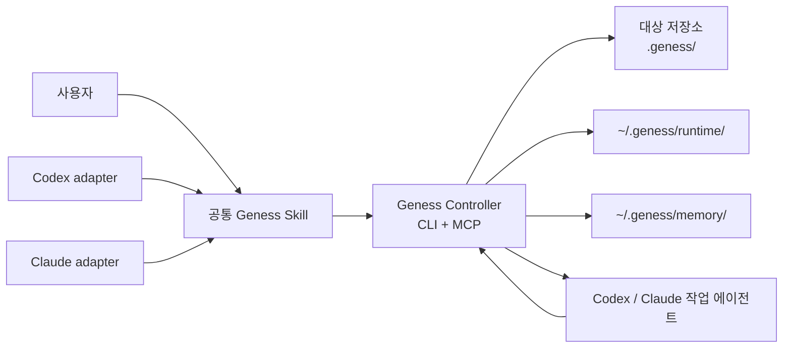

# Geness 구현 계획

> 상태: Draft
> 작성일: 2026-08-20
> 저장소: `claude-studio/geness`
> 제품 구현 상태: HOLD
> 문서 foundation: CLEAR

## 1. 문서 목적

이 문서는 Geness의 제품 경계, 문서 계약, 상태 머신, 저장 경계, 구현 순서와 완료
조건을 소유한다. 현재 repository의 검증된 상태는 Progress가 소유하고, 채택된
설계 결정은 Accepted ADR이 소유한다.

Geness는 사용자의 암묵지를 질문으로 드러내고, 검증된 실행 계약으로 결정화한 뒤,
계획·구현·관찰·검증·재개를 관리하는 host-neutral control plane이다.

```text
brief
→ contract
→ plan
→ impl
→ verify
→ done
       ↘ resume
```

공개 단계 명칭은 다음으로 고정한다.

| 단계 | 의미 | 기본 호출 예 |
| --- | --- | --- |
| brief | Interview와 요구사항 정리 | gee brief 주제 |
| contract | 검증된 실행 계약 생성·승인 | gee contract task |
| plan | 승인 계약에서 실행 계획 생성 | gee plan task |
| impl | 승인 계획의 단계별 구현 | gee impl task |
| verify | 실제 evidence 기반 최종 검증 | gee verify task |
| done | verify 승인 후 자동 종료 | gee done task |
| resume | checkpoint 또는 blocker에서 재개 | gee resume task |

gee는 slash command를 직접 호출하는 방식이 아니라 description 기반 intent router를
통해 단계를 선택한다. 자연어 요청도 stage description으로 라우팅하며, 설명 간
충돌이 있으면 자동 추론하지 않고 한 번만 선택을 요청한다.

각 단계의 기본 화면은 전체 tool log가 아니라 핵심 상태만 보여준다.

- 현재 stage와 상태 변화
- 완료 AC 또는 task 수와 전체 수
- 사용자 판단 필요 여부
- blocker, retry, resume 필요 여부
- 최종 verdict와 다음 stage

raw command output, subagent transcript, heartbeat와 대용량 evidence는 runtime/log/
evidence 영역에 저장하고, 상세 내용은 사용자가 요청할 때만 조회한다.

Geness는 단일 문서 생성 스킬이 아니라 다음 요소를 함께 배포하는 상태 기반 플러그인이다.

- Codex와 Claude Code에서 공통으로 사용하는 Skill
- 인터뷰·승인·실행·검증 상태를 관리하는 Controller
- 공통 CLI 및 MCP 도구
- 대상 저장소에 생성되는 프로젝트 문서
- 사용자 로컬의 runtime 및 memory 저장소
- Codex와 Claude Code 각각의 얇은 설치·실행 어댑터

### 1.1 설계 출처와 독립성

Geness의 인터뷰 경험은
[`Q00/ouroboros`](https://github.com/Q00/ouroboros/tree/25f958dd7938d3c383ccfd14d551467bcf6e6bd6)의
Socratic interview와 specification-first workflow를 참고했다. 질문과 실행 역할 분리,
사실과 사용자 결정의 provenance, 답변 refine, closure/restate/approval Gate와 승인된
사양을 실행 계약으로 쓰는 원칙을 설계 입력으로 삼았다.

Geness는 Ouroboros를 포팅하거나 호환 구현하지 않는다. Seed, ontology, model routing,
EventStore와 전체 evolution loop는 Geness 계약이 아니다. 대신 contract stage에서
사람이 읽는 spec 문서, machine-readable frontmatter, digest, QA와 user adoption gate를
독립적으로 정의한다. 문서 형식, 상태 모델, 저장 경계와 실패 학습 알고리즘은 독립
사양으로 정의한다. 정확한 채택·변형·비채택 범위와
MIT 라이선스 처리는
[Ouroboros Reference Findings](./research/OUROBOROS_REFERENCE_FINDINGS.md)가 소유한다.

Geness 자체의 docs-first 개발 방식은
[`FRONT-JB/mcx`](https://github.com/FRONT-JB/mcx/tree/c49d2493f94fba6928ed20a46c9db8aecdcd3087/docs)의
문서 소유권 구조를 참고했다. 적용 차이는
[MCX Reference Findings](./research/MCX_REFERENCE_FINDINGS.md)에 기록한다.

## 2. 목표

### 2.1 제품 목표

- 한 번의 입력으로 문서를 바로 생성하지 않고, 중요한 미결정이 닫힐 때까지 사용자에게 계속 질문한다.
- 코드에서 확인 가능한 사실과 사용자가 결정해야 할 판단을 구분한다.
- 목표, 범위, 예외, 실패 동작과 검증 방법을 명시적으로 결정한다.
- 인터뷰 결과를 대상 저장소의 재개 가능한 문서로 남긴다.
- 승인된 명세를 검증 가능한 Acceptance Criteria와 실행 계획으로 변환한다.
- plan Gate를 승인한 뒤에는 사용자 재확인 없이 impl부터 verify, done 또는 resume까지 자동으로 진행한다.
- Codex 또는 Claude Code에서 실행을 시작하고, 중단 후 다른 호스트에서도 이어갈 수 있게 한다.
- impl 이후에는 stage transition, AC 진행률, blocker와 최종 verdict만 기본 화면에 표시한다.
- 모든 필수 AC에 증거가 연결되기 전에는 작업을 완료 처리하지 않는다.
- 실행 중 발견된 잘못된 가정을 기록하되, 알고리즘을 통과한 교훈만 장기 기억으로 승격한다.
- 관련 기억만 짧게 조회하여 속도와 컨텍스트 토큰을 보호한다.

### 2.2 성공 기준

- 동일한 Geness 패키지를 Codex와 Claude Code에 설치할 수 있다.
- 두 호스트가 동일한 프로젝트 ID, task 문서, 상태 전이와 DB를 사용한다.
- 대상 저장소에 `.geness/project.json`과 `.geness/tasks/**`가 생성된다.
- 인터뷰가 차단 미결정과 모순을 남긴 채 자동 종료되지 않는다.
- 승인된 계약이 변경되면 기존 승인이 자동으로 무효화된다.
- 실행 중단 후 체크포인트에서 안전하게 재개할 수 있다.
- 모든 required AC와 evidence가 검증돼야 done으로 전환된다.
- 일회성 실패는 장기 기억으로 자동 주입되지 않는다.
- memory 검색은 구조 필터와 FTS 상위 결과만 반환한다.
- 일반적인 수정·재검증은 자동 loop로 처리하고, contract·scope·권한·안전 경계를
  바꾸는 경우에만 사용자에게 멈춰서 질문한다.

## 3. 비목표

초기 버전에서는 다음을 구현하지 않는다.

- Ouroboros의 ontology, evolution, event-store 전체 복제
- PM 인터뷰와 개발 인터뷰를 나누는 이중 파이프라인
- 중앙 클라우드 서비스 또는 계정 간 자동 동기화
- 웹 GUI나 별도 데스크톱 애플리케이션
- vector DB 또는 embedding 기반 검색
- 사용자 승인 없는 Git commit, push, PR 생성
- branch checkout, worktree 생성·삭제·전환과 Git 작업공간 lifecycle 관리
- v1에서 다른 컴퓨터 간 자동 runtime/evidence 동기화와 cloud resume
- v1에서 여러 worktree가 같은 task를 동시에 수정하는 multi-writer 실행
- 사용자 승인 없는 요구사항·AC 변경
- 무제한 background daemon 또는 무한 재시도
- 저장소 밖 임의 경로에 대한 자동 수정
- 원본 로그나 비밀정보의 Git 커밋

## 4. 확정된 결정

- [x] 플러그인 이름은 `geness`다.
- [x] 이 저장소가 Geness 플러그인의 소스 루트다.
- [x] 하나의 소스 저장소에서 Codex와 Claude Code를 함께 지원한다.
- [x] branch와 worktree는 사용자가 준비하며 Geness는 이를 생성·삭제·전환하지 않는다.
- [x] v1 cross-host resume은 같은 컴퓨터·같은 사용자 데이터 루트·사용자 준비 worktree로 제한한다.
- [x] v1에서는 task당 active writer 하나만 허용하고 다른 host/process는 observer로 제한한다.
- [x] 공통 기능은 하나의 Controller와 상태 머신으로 구현한다.
- [x] v1 Controller는 Go + Go modules + CGO + 명시적 `sqlite_fts5` build contract를 사용한다.
- [x] 공통 application service가 canonical command API이며 CLI/MCP는 thin transport다.
- [x] 호스트별 매니페스트와 필요한 어댑터만 분리한다.
- [x] 프로젝트 문서는 Geness 설치 경로가 아니라 실제 작업 대상 저장소에 생성한다.
- [x] 대상 저장소의 Geness 루트는 `.geness/`다.
- [x] 프로젝트 식별 파일은 `.geness/project.json`이다.
- [x] task 문서는 `.geness/tasks/<task-slug>--<task-id>/`에 둔다.
- [x] 사용자 로컬 데이터 루트는 기본적으로 `~/.geness/`다.
- [x] 사용자 로컬 하위 이름은 `memory/`와 `runtime/`을 사용한다.
- [x] 저장소 폴더명만 프로젝트 식별자로 사용하지 않는다.
- [x] 프로젝트는 `project_id`, clone/worktree 실행 환경은 `workspace_id`로 구분한다.
- [x] clone은 project lineage를 공유하되 workspace는 분리하고, rename은 metadata-preserving same workspace, worktree는 distinct workspace, fork/동명 repository는 explicit detach/rekey 뒤 새 project로 취급한다.
- [x] 사람이 읽고 Git으로 공유하는 계약 정본은 대상 저장소의 Markdown 문서다.
- [x] DB, 원본 로그, 잠금, lease와 대용량 증거는 `~/.geness/`에 둔다.
- [x] `memory.sqlite3`와 `runtime.sqlite3`의 수명과 책임을 분리한다.
- [x] 실패를 발견했다고 바로 장기 기억으로 주입하지 않는다.
- [x] 장기 기억 승격·감쇠·만료는 LLM의 자유 판단이 아닌 이벤트와 규칙으로 결정한다.

## 5. 핵심 원칙

### 5.1 공통 코어, 얇은 호스트 어댑터

Skill과 호스트별 hook은 사용자 경험을 연결한다. 프로젝트 ID, 상태 전이, 승인 digest, AC 검증, lease와 기억 lifecycle의 권위자는 공통 Controller다.

### 5.2 사실과 판단을 분리한다

- 코드·설정·테스트에서 정확히 확인되는 사실은 Geness가 조사한다.
- 선호, 우선순위, 새로운 동작, 허용 가능한 위험은 사용자가 결정한다.
- 코드 사실을 사용자 요구사항으로 자동 승격하지 않는다.
- 모든 답변에는 `from-user`, `from-code`, `from-research` 등의 provenance를 남긴다.

### 5.3 문서와 런타임 상태를 분리한다

- 대상 저장소의 `.geness/`: 사람이 검토하고 Git으로 공유할 계약과 실행 요약
- 사용자 홈의 `~/.geness/runtime/`: 변경 가능한 실행 상태와 원본 증거
- 사용자 홈의 `~/.geness/memory/`: 검증된 교훈과 빠른 검색 인덱스
- 플러그인 설치 폴더: 읽기 전용 코드, Skill, schema와 template

### 5.4 완료는 증거로 판정한다

질문 횟수, LLM의 자신감 또는 구현 종료 메시지는 완료 근거가 아니다. 모든 필수 AC가 통과하고 각 AC에 증거가 연결돼야 완료된다.

### 5.5 실패는 기억 후보일 뿐이다

실패 원본은 먼저 runtime에 저장한다. 반복성, 인과관계 또는 guard 효과가 입증된 항목만 memory로 승격한다.

### 5.6 필요한 기억만 지연 로딩한다

전체 memory나 evidence를 프롬프트에 넣지 않는다. 정확한 fingerprint, 구조 필터, FTS 순으로 좁힌 소수의 요약만 전달하고, 선택된 증거만 추가로 읽는다.

## 6. 전체 구조



역할은 다음과 같다.

| 구성 요소 | 책임 |
| --- | --- |
| 공통 Skill | 반복 질문, 답변 정제, 사용자 승인 UX |
| Codex adapter | Codex 매니페스트, MCP·hook 연결, 호스트 정보 전달 |
| Claude adapter | Claude 매니페스트, MCP·hook 연결, 호스트 정보 전달 |
| Controller | 상태 머신, schema 검증, digest, lease, 체크포인트, 기억 알고리즘 |
| 작업 에이전트 | 승인된 범위에서 코드 조사·수정·검증 수행 |
| 프로젝트 문서 | 인터뷰·승인 계약·계획과 실행 요약의 휴대 가능한 문서 |
| runtime DB | 현재 실행의 재개, 동시성, 시도 및 원본 실패 |
| memory DB | 검증된 교훈의 구조 검색과 FTS 검색 |

## 7. 플러그인 저장소 구조

목표 구조는 다음과 같다. 구현 언어와 패키지 도구가 결정되면 언어별 디렉터리를 구체화한다.

```text
geness/
├── .codex-plugin/
│   └── plugin.json
├── .claude-plugin/
│   └── plugin.json
├── .mcp.json
├── skills/
│   └── workflow/
│       ├── SKILL.md
│       └── references/
├── adapters/
│   ├── codex/
│   │   ├── mcp.json
│   │   └── hooks.json
│   └── claude/
│       ├── mcp.json
│       └── hooks.json
├── core/
│   ├── project/
│   ├── interview/
│   ├── specification/
│   ├── planning/
│   ├── execution/
│   ├── verification/
│   └── memory/
├── schemas/
├── templates/
├── bin/
│   ├── geness
│   └── geness-controller
├── tests/
├── AGENTS.md
├── CLAUDE.md -> AGENTS.md
└── docs/
    ├── README.md
    ├── 00_GENESS.md
    ├── 01_ARCHITECTURE.md
    ├── 02_TASK_LIFECYCLE.md
    ├── 03_STORAGE.md
    ├── 04_HOST_INTEGRATION.md
    ├── 05_INTERVIEW.md
    ├── 06_SPECIFICATION.md
    ├── 07_EXECUTION.md
    ├── 08_VERIFICATION.md
    ├── 09_LEARNING.md
    ├── PLAN.md
    ├── adr/
    ├── progress/
    └── research/
```

호스트별 파일에는 공통 비즈니스 규칙을 중복하지 않는다. 두 매니페스트는 동일한
plugin name과 version을 사용하고, 빌드 또는 검증 과정에서 불일치를 차단한다.
Claude plugin의 MCP 설정은 plugin root의 .mcp.json에 두고 plugin-root path variable로
geness-controller를 실행한다. .claude-plugin/에는 manifest만 둔다.

문서별 소유권, 읽는 순서와 HOLD/CLEAR 규칙은 [문서 안내](./README.md)가 소유한다.
PLAN은 미래 구현과 완료 조건이고, 실제 현재 상태는
[Progress](./progress/README.md)가 소유한다.

## 8. 대상 저장소 구조

Geness를 사용하는 실제 대상 저장소에는 다음 구조를 생성한다.

```text
<target-repository>/
└── .geness/
    ├── project.json
    ├── config.yaml                 # 포함 여부는 Phase 0에서 결정
    └── tasks/
        └── <task-slug>--<task-id>/
            ├── interview.md
            ├── spec.md
            ├── plan.md
            ├── run.md
            └── verification.md
```

### 8.1 `project.json`

최소 계약은 다음과 같다.

```json
{
  "schema_version": 1,
  "project_id": "<stable-id>",
  "display_name": "<repository-name>",
  "created_at": "<RFC3339>"
}
```

- `project_id`는 폴더명과 독립적인 안정 ID다.
- `display_name`은 경로와 UI에 사용하는 사람이 읽을 수 있는 이름이다.
- clone과 fork에서 ID를 공유할지 여부는 Phase 0 결정 항목이다.
- `workspace_id`는 사용자 로컬에서 현재 clone/worktree를 구분하며 프로젝트 문서의 정체성으로 사용하지 않는다.

### 8.2 대상 루트 결정 규칙

1. 사용자가 명시한 project root가 있으면 우선한다.
2. 현재 위치부터 상위로 `.geness/project.json`을 찾는다.
3. 없으면 Git top-level을 후보로 사용한다.
4. 후보가 여러 개이거나 Git root가 없으면 사용자에게 선택을 요청한다.
5. 초기화 승인을 받은 뒤에만 `.geness/`를 생성한다.
6. 모든 출력 경로가 확정된 target root 내부인지 canonical path로 검증한다.
7. 플러그인 설치·cache 디렉터리를 target으로 추론하지 않는다.

### 8.3 task 문서

#### `interview.md`

- 최초 요청과 초기 문맥
- 코드·문서에서 확인한 사실과 출처
- 질문과 원본 답변
- 정제된 결정, 이유, 제약, 범위 밖
- 가정, 반례와 예외
- 변경·폐기된 결정과 superseded 관계
- 모순과 미결정 ledger
- closure audit 결과

#### `spec.md`

- 해결할 문제와 기대 결과
- 목표와 비목표
- 사용자 관점 동작과 도메인 규칙
- 제약 및 관련 코드 문맥
- Acceptance Criteria
- 실행 허용 범위와 테스트 정책
- 미결정 또는 명시적으로 미룬 항목
- 승인자, 승인 시각과 contract digest

#### `plan.md`

- 실행 전 점검 결과
- 요구사항과 AC 추적 관계
- AC별 구현 단계와 의존성
- 변경 예상 파일 및 경계
- 테스트·검증 방식
- 증거 생성 방법
- 위험, 중단 및 재계획 조건
- 승인 정보가 필요할 경우 plan digest

#### `run.md`

- run ID와 사용한 spec/plan digest
- 시작·종료 시각과 실행 호스트
- AC별 상태와 검증 요약
- 시도별 결과와 중요한 변경
- 증거 ID, 경로 및 해시
- 계획 이탈, 재계획과 재승인 이력
- 차단 사유 또는 최종 완료 상태

원본 명령 출력, 비밀정보 또는 대용량 evidence는 프로젝트 문서에 넣지 않는다. `run.md`에는 정제된 요약과 로컬 evidence reference만 남긴다.

#### verification.md

- verify stage의 spec/plan digest와 execution lineage
- mechanical command와 결과 요약
- 실제 실행·화면·API·파일 observation
- semantic AC verdict와 evidence reference
- verifier identity/type와 independence
- PASS, FAIL, INDETERMINATE 또는 NOT_RUN
- 최종 APPROVED, REVISE 또는 BLOCKED verdict

verification.md는 별도 human-readable final verification projection이다. AC verdict,
evidence freshness, verifier provenance와 completion authority의 정본은 runtime DB이며,
verification.md는 그 결과를 revision/digest와 함께 portable하게 보여준다. 수동 편집이나
stale projection이 발견되면 Controller가 자동으로 덮어쓰지 않고 reconciliation을
수행한다.

## 9. 사용자 로컬 데이터 구조

기본 경로는 `GENESS_HOME`으로 재정의할 수 있고, 미설정 시 `~/.geness/`를 사용한다.

```text
~/.geness/
├── memory/
│   └── <repo-slug>--<project-id>/
│       ├── events.jsonl
│       └── memory.sqlite3
└── runtime/
    └── <repo-slug>--<project-id>/
        └── <workspace-id>/
            ├── runtime.sqlite3
            ├── locks/
            ├── logs/
            └── evidence/
```

`repo-slug`는 가독성을 위한 값이고 식별 권위는 `project_id`다.

### 9.1 `runtime.sqlite3`

현재 실행을 안전하게 중단·복구·재개하기 위한 mutable 상태 저장소다.

최소 저장 대상:

- run ID와 task ID
- task 상태와 다음 허용 전이
- 승인된 spec 및 plan digest
- AC별 상태, 시도 횟수와 마지막 결과
- 실행 host와 host session reference
- project ID와 workspace ID
- writer lease, owner와 heartbeat
- 실행 step과 checkpoint
- 명령·로그·evidence reference와 해시
- 실패 fingerprint 및 lesson candidate
- 재계획·재승인 이력

원본 로그와 evidence blob은 파일로 저장하고 DB에는 메타데이터, 경로와 해시만 둔다. 완료된 runtime은 보존 정책에 따라 정리할 수 있다.

### 9.2 `memory.sqlite3`

관련 작업을 시작할 때 과거의 검증된 교훈을 짧고 빠르게 찾는 검색 저장소다.

최소 저장 대상:

- lesson ID와 lifecycle 상태
- project, module, file, symbol 및 task type scope
- trigger와 fingerprint
- wrong assumption
- actual rule
- root cause
- proposed 또는 verified guard
- 발생 횟수와 독립 run 수
- eligible exposure와 unassisted success 수
- guard가 예방한 횟수
- 마지막 발생·조회 시각
- evidence reference와 해시
- 검색용 짧은 요약

`events.jsonl`은 lesson의 생성·병합·승격·만료를 append-only로 보존하는 감사 및 재구축 원본이다. SQLite/FTS5는 구조 필터, 순위, 결과 제한과 짧은 snippet을 위한 인덱스다.

두 DB를 분리하는 이유는 다음과 같다.

- runtime을 TTL로 삭제해도 장기 기억은 유지된다.
- memory 검색이 실행 로그 테이블의 크기에 영향을 받지 않는다.
- 백업·migration·권한과 보존 정책을 독립적으로 적용할 수 있다.
- 일시적 실패가 장기 기억 검색에 섞이는 것을 구조적으로 차단한다.

## 10. task 상태 머신

Controller가 저장하는 canonical 상태는 다음과 같다.

```text
INITIALIZING
→ INTERVIEWING
→ SPEC_READY
→ SPEC_APPROVED
→ PREFLIGHT
→ PLAN_READY
→ PLAN_APPROVED
→ RUNNING
→ VERIFYING
→ COMPLETED
```

Happy path 밖의 상태:

PUBLIC_STAGE:
brief | contract | plan | impl | verify | done | resume

자동 진행 규칙:

- brief, contract와 plan은 사용자 판단이 필요한 Gate를 포함한다.
- plan approval가 끝나면 impl은 자동으로 시작할 수 있다.
- impl의 정상 종료는 verify로 자동 전환한다.
- verify PASS는 done으로 자동 전환한다.
- verify의 수정 가능한 실패는 resume으로 자동 전환하고, checkpoint에서 수정 후
  다시 verify한다.
- contract, scope, 권한, 안전 경계를 바꾸는 문제는 자동 진행을 멈추고 사용자에게
  질문한다.

```text
PAUSED
BLOCKED
REOPENED
FAILED
CANCELLED
```

OQ-004 C-01 결정에 따라 task-level `FAILED`는 명시적인 user reopen receipt가 있을 때만
`REOPENED`로 복구하고, `CANCELLED`는 terminal로 유지한다. 자동 reopen은 허용하지 않는다.
전체 state graph의 진입 edge와 production receipt validation은
[ADR-0013](./adr/0013-task-lifecycle-recovery.md) 범위 밖의 후속 evidence다.

핵심 규칙:

- 승인 전에는 실행할 수 없다.
- 승인 후 contract digest가 바뀌면 승인을 무효화하고 `REOPENED`로 전환한다.
- 실행 전 점검으로 가정이 틀렸음이 밝혀지면 인터뷰 또는 명세 단계로 돌아간다.
- 실행 중 기대 동작, 범위 또는 AC를 바꿔야 하면 사용자 재승인을 요구한다.
- 구현 방법만 바뀌고 계약에 영향이 없으면 plan 이력과 runtime checkpoint만 갱신한다.
- 두 호스트가 동일 task의 writer가 될 수 없다.
- 모든 필수 AC와 evidence가 충족돼야 `COMPLETED`를 외부에 노출한다.
- 반복 실패, 권한 부족, 외부 의존성 등의 중단은 typed `BLOCKED` reason으로 기록한다.
- plan stage의 Gate 통과를 뜻하는 내부 상태는 PLAN_APPROVED로 기록한다. actor는
  user 또는 policy로 기록하며,
  일반 plan의 policy 승인 범위는 Phase 0 결정 전까지 사용자 승인을 생략하지 않는다.

### 10.1 Public stage와 internal state 매핑

public stage는 사용자·gee router·compact report에 노출하고, Controller는 기존
canonical internal state를 저장한다.

| Public stage | Internal state 또는 의미 |
| --- | --- |
| brief | INTERVIEWING |
| contract | SPEC_READY → SPEC_APPROVED |
| plan | PREFLIGHT → PLAN_READY → PLAN_APPROVED |
| impl | RUNNING |
| verify | VERIFYING |
| done | COMPLETED를 닫는 idempotent Controller transition |
| resume | PAUSED, BLOCKED 또는 REOPENED에서 재개하는 action |
| setup | task 이전 project/workspace readiness |

done과 resume은 별도의 새로운 terminal state가 아니다. `gee done`은 verify PASS 뒤
Controller completion transaction을 idempotently 재확인하는 명령으로만 사용할 수 있고,
일반 흐름에서는 사용자에게 다시 묻지 않고 자동 호출한다. 내부 state의 의미와 completion
authority는 Constitution, Lifecycle과 Controller가 소유한다.

## 11. brief stage 설계

### 11.1 역할 분리

- 공통 인터뷰 엔진: 다음에 닫아야 할 가장 큰 미결정을 선택한다.
- 메인 호스트 세션: 코드 조사, 답변 routing과 사용자 대화를 담당한다.
- 사용자: 판단, 선호, 범위, trade-off와 승인 결정을 내린다.
- 조사 subagent: 코드 사실 또는 필요한 외부 사실을 독립적으로 확인한다.

### 11.2 질문 정책

- 한 번에 영향이 가장 큰 미결정 하나를 질문한다.
- 질문 전에 코드·문서·설정에서 확인할 수 있는 내용을 먼저 조사한다.
- 코드 사실을 다시 묻지 않되, 그 사실이 원하는 동작인지 여부는 사용자에게 확인한다.
- 답변에 따라 다음 질문과 ledger를 다시 계산한다.
- 정상 흐름뿐 아니라 반례, 실패 동작, 경계 조건과 비목표를 확인한다.
- 앞선 결정이나 코드 근거와 충돌하면 자동 해석하지 않고 correction 질문으로 되돌린다.
- 질문 횟수 상한이나 LLM의 모호도 점수만으로 인터뷰를 종료하지 않는다.
- non-user fact answer가 세 번 연속되면 미해결 사용자 판단을 반드시 다음에 묻는다.
- 한 gap 유형을 최대 세 번 다룬 뒤 전체 ledger breadth를 다시 점검한다.
- closure Gate 통과 뒤 계약을 바꾸지 않는 wording/극단 edge case만으로 과잉 질문하지
  않는다.
- exact manifest/config literal만 자동 확인하고, code intent 추론은 사용자에게 확인한다.

### 11.3 답변 provenance 및 정제

각 답변은 다음 origin 중 하나 이상을 가진다.

```text
from-user
from-code
from-research
```

자유 서술 답변은 다음 구조로 정제한다.

```text
Decision
Reasoning
Constraints
Out of scope
Codebase context
```

사용자 답변을 정제한 경우, 의미가 빠지거나 왜곡되지 않았는지 사용자에게 확인한 뒤 decision으로 잠근다. 결정 수정은 기존 기록을 삭제하지 않고 `superseded_by` 관계로 남긴다.

### 11.4 인터뷰 ledger

최소 ledger는 다음을 추적한다.

- scope와 non-goals
- constraints와 code context
- expected outputs와 failure behavior
- acceptance 및 verification
- assumptions
- contradictions
- open questions와 deferred decisions

### 11.5 인터뷰 종료 게이트

다음 조건을 모두 충족해야 contract candidate가 CONTRACT_READY가 될 수 있다.

- 차단 상태 open question이 0개다.
- 결정 간 unresolved contradiction이 0개다.
- 목표, 범위, 비목표, 예외와 실패 동작이 문서화됐다.
- 중요한 가정에 코드 근거 또는 사용자 확인이 있다.
- 모든 요구사항을 검증 가능한 결과 상태로 바꿀 수 있다.
- closer 관점에서 명세를 만들 정보가 충분하다.
- contrarian 관점에서 HIGH severity 반례가 남지 않는다.
- gap-hunter 관점에서 HIGH severity 누락이 남지 않는다.
- 합의 목표를 한 문장으로 restate하고 사용자가 명시적으로 승인했다.

숫자 기반 ambiguity score는 보조 신호로 도입할 수 있지만 승인 권위자로 사용하지 않는다.
Restatement가 수정되면 답변 refine부터 다시 확인하고 interview를 reopen한 뒤 현재
revision으로 closure audit을 재실행한다. 이 승인은 interview 이해 확인이며 이후
`spec.md` digest의 명시적 승인을 대신하지 않는다.

## 12. contract stage와 AC 계약

`spec.md`는 Markdown 본문과 machine-readable frontmatter를 함께 사용하는 방향을 우선 검토한다.

예시:

```yaml
---
schema_version: 1
task_id: task-01J...
contract_revision: 1
status: candidate
source:
  brief_id: brief-01J...
  brief_revision: 1
profile: auto
digest_profile: geness.semantic-json-v1
contract_digest: sha256:...
approval:
  brief_restate: approved
  contract_adoption: pending
  approved_at: null
  approved_by: null
goal: ...
non_goals: []
constraints: []
decisions: []
context:
  relevant_paths: []
  verified_facts: []
acceptance_criteria:
  - id: AC-001
    outcome: ...
    required: true
    mechanical:
      command: null
      expect: null
    acting:
      required: false
      procedure: null
      timeout_seconds: null
    manual:
      procedure: null
      observer: null
    artifacts: []
    source_refs: []
execution:
  allowed_scope: []
  forbidden_scope: []
  test_policy: ...
  retry:
    max_successors: 5
completion_policy: all_required_acceptance_criteria_verified
---
```

AC 작성 규칙:

- 최소 한 개 이상의 AC가 있어야 한다.
- AC는 구현 단계가 아니라 완료된 결과 상태를 기술한다.
- 각 AC에는 자동 검증 명령 또는 명시적인 수동 검증 절차가 있어야 한다.
- artifact 경로는 target root 기준의 정확한 상대 경로다.
- `expect`는 판정 가능한 literal, pattern 또는 관찰 조건이다.
- 모든 요구사항은 하나 이상의 AC에 연결된다.
- 하나의 AC가 지나치게 많은 독립 결과를 묶지 않는다.

이 schema는 기존 RPI Stage Guide의 field 이름을 호환성 정본으로 사용하지 않는다.
brief revision, contract revision, profile, mechanical/acting/manual verifier, source refs와
bounded successor policy를 Geness v1의 새 contract로 정의한다. 기존 문서와의 매핑은
Phase 0 migration/ADR에서 결정하고, 구현 전에는 schema example만으로 compatibility를
주장하지 않는다.

### 12.1 승인 digest

- digest는 [ADR-0017](./adr/0017-versioned-semantic-digest.md)의
  `geness.semantic-json-v1` semantic projection을 canonical serialization한 값의
  SHA-256으로 계산한다. contract projection은 profile, goal, non-goals, constraints,
  decisions, relevant context, AC 및 execution/retry policy를 포함하고, plan projection은
  current contract digest와 plan steps, dependency/order, allowed scope와 test policy를
  포함한다.
- status, 실행 시각, run result, checkpoint, lease와 editorial body처럼 변하거나
  presentation-only인 필드는 approval digest에서 제외한다. object key order는 무시하고
  의미가 있는 array order는 보존한다.
- number, Unicode, duplicate-key와 escaping edge rule은 profile golden vector로 고정하며
  host serializer 기본값에 암묵적으로 위임하지 않는다.
- semantic projection이 바뀌면 승인과 하위 plan/run을 무효화하고, 같은 projection의
  editorial-only 변경은 digest를 바꾸지 않는다.
- 해시 대상 필드가 바뀌면 승인과 하위 plan을 무효화한다.
- 승인 receipt와 digest는 `spec.md` 및 runtime DB 양쪽에 기록한다.
- 사용자 승인을 받지 않은 silent rewrite를 허용하지 않는다.

### 12.2 contract QA

contract stage는 Interview 결과를 받아 spec을 만든 뒤 다음 검사를 통과해야 한다.

- goal, non-goal, constraint와 AC 간 내부 모순이 없다.
- AC는 구현 방법이 아니라 관찰 가능한 outcome이다.
- 모든 requirement가 하나 이상의 AC에 연결된다.
- 각 required AC에 실제 command 또는 명시적인 manual evidence 절차가 있다.
- artifact path가 target root 밖으로 나가지 않는다.
- execution allowed scope가 plan으로 분해 가능하다.
- 기존 code context와 stale reference가 확인된다.
- closer, contrarian, gap-hunter 관점의 high severity gap이 남지 않는다.

QA 결과는 PASS, REVISE, FAIL로 기록한다. REVISE 후보는 사용자가 채택한 것만 다음
spec revision에 적용하며, 승인되지 않은 자동 수정은 금지한다.

Ouroboros에서 관찰한 adoption 원칙을 Geness에 독립적으로 적용한다.

1. brief에서 사용자가 restated goal을 승인한다.
2. Codex가 contract candidate와 구조적 QA 결과를 만든다.
3. QA가 REVISE를 반환하면 Claude가 후보를 compact하게 보여주고 사용자가 채택·거절한다.
4. 채택된 후보만 spec revision과 digest에 반영한다.
5. QA PASS 뒤에는 전체 계약을 다시 장문으로 승인받지 않고, goal·required AC·constraint·
   out-of-scope·digest를 보여주는 compact adoption confirmation만 사용한다.
6. adoption confirmation과 valid digest가 있을 때 CONTRACT_APPROVED를 만든다.

brief의 restate approval과 contract의 digest adoption은 서로 다른 artifact를 승인한다.
그러나 사용자가 같은 내용을 두 번 읽고 승인하게 만들지 않는다. 계약 후보에 의미 있는
QA 수정이 없으면 compact confirmation으로 끝내고, 의미 있는 수정이 있으면 adoption
질문을 거친다.

## 13. plan stage와 실행 전 점검

명세 승인 후, 실제 실행 계획을 확정하기 전에 다음을 점검한다.

- 실제 Git root와 `.geness/project.json`
- branch, worktree와 기존 dirty state
- 명세가 언급한 파일, symbol, 데이터 구조와 기존 테스트
- 빌드·테스트·lint 명령의 실제 존재 여부
- 권한, 외부 서비스, 네트워크와 환경 제약
- 계획이 변경할 파일과 허용 범위의 일치 여부
- 코드 근거 없이 작성된 가정
- 관련 verified/enforced memory 상위 결과

잘못된 가정이 발견되면 AC를 억지로 수정하지 않고 명세 또는 인터뷰를 다시 연다.

계획 종료 게이트:

- 모든 명세 요구사항이 AC에 연결된다.
- 모든 AC에 구현 step과 검증 방식이 연결된다.
- 실행 순서와 의존성이 정해졌다.
- 검증 명령 또는 수동 evidence 절차가 실제로 실행 가능하다.
- 중단 및 재계획 조건이 정의됐다.
- 차단 미결정이 0개다.
- Plan Gate가 통과했고 `approval_actor: user | policy` receipt와 필요한 digest가 있다.
- policy 승인 범위가 확정되기 전이거나 고위험·scope 확대 작업이면 명시적 사용자
  승인이 있다.

## 14. impl·verify·done/resume stages

### 14.0 impl 이후 자동 진행

impl은 plan approval 이후 Codex worker가 소유한다. 다음 흐름은 기본적으로 사용자
질문 없이 Controller가 진행한다.

~~~text
impl started
  → phase checkpoint
  → self-validation
  → implementation result
  → verify
  → APPROVED: done
  → REVISE/repairable failure: resume
  → checkpoint repair
  → verify
~~~

자동 resume은 단순 무제한 retry가 아니라 Ouroboros에서 관찰한 bounded convergence
원칙을 독립적으로 적용한다. verify가 REVISE를 반환하면 현재 failure evidence와
feedback을 고정하고, 같은 approved contract/AC를 유지하는 successor attempt만 만든다.
기본 successor 상한은 task당 5회이며, 정확한 wall-clock budget과 동일 fingerprint
조기 중단 규칙은 Phase 0에서 결정한다.

- implementation/test 오류는 Codex successor impl로 자동 전달한다.
- Claude verify가 매 successor를 다시 평가한다.
- acceptance criteria, constraints, scope와 completion policy를 자동 완화하지 않는다.
- 같은 failure fingerprint 반복, progress 부재, oscillation 또는 5회 successor budget
  초과는 BLOCKED다.
- contract/goal/AC/scope/권한/외부 write/destructive action 변경은 자동 loop 밖이다.
- 자동 loop 밖의 변경은 brief 또는 contract stage의 사용자 결정으로 되돌린다.
- bounded loop가 PASS를 얻은 경우에만 done transaction을 실행한다.

각 successor에는 predecessor attempt, feedback, changed paths, current digest와
iteration/budget을 연결한다. 사용자에게는 iteration N/M, AC 진행률, attention/blocker와
최종 verdict만 표시한다.

### 14.1 실행 시작

1. project ID, workspace ID와 task ID를 확인한다.
2. 승인된 spec/plan digest를 다시 계산한다.
3. schema와 state transition을 검증한다.
4. `project_id + task_id` writer lease를 획득한다.
5. dirty state와 실행 환경 snapshot을 기록한다.
6. 관련 memory를 제한적으로 조회한다.
7. 첫 checkpoint를 저장한 뒤 실행한다.

### 14.2 실행 규칙

- AC와 dependency 단위로 작업을 분해한다.
- 독립적인 조사·구현·검증은 subagent로 병렬화할 수 있다.
- 승인된 요구사항을 작업 에이전트가 조용히 변경할 수 없다.
- 각 시도에 입력 contract, 변경, 명령, 결과 및 evidence를 연결한다.
- 같은 실패 fingerprint가 반복되면 무한 재시도하지 않고 재계획 또는 `BLOCKED`로 전환한다.
- 외부 쓰기, 위험한 명령 또는 allowed scope 확대는 별도 승인을 요구한다.
- 특정 Codex/Claude 대화 기록만을 복구 수단으로 사용하지 않는다.

### 14.3 잘못된 가정을 발견한 경우

1. 현재 attempt를 실패 또는 중단으로 기록한다.
2. 코드·테스트·명령 출력 등 실제 근거를 evidence로 저장한다.
3. 실패 fingerprint와 lesson candidate를 생성한다.
4. spec 또는 AC에 미치는 영향을 판정한다.
5. 계약 영향이 있으면 `REOPENED`로 전환하고 해당 문서를 갱신한다.
6. 필요한 사용자 결정을 다시 질문한다.
7. 새 digest를 승인받은 뒤 재계획하고 실행한다.

### 14.4 호스트 간 재개

Geness는 branch 또는 worktree를 자동으로 만들거나 전환하지 않는다. resume을 실행하는
사용자가 target root와 원하는 current worktree를 먼저 준비해야 하며, Controller는
현재 경로·project_id·workspace_id·digest가 checkpoint와 맞는지만 검증한다. 불일치하면
자동 전환하지 않고 사용자에게 SETUP_ATTENTION을 반환한다.

v1에서 호스트 간 재개는 같은 machine의 Claude↔Codex 전환만 지원한다. 다른 machine의
runtime/evidence 이동, cloud sync와 자동 workspace discovery는 v1의 지원 범위가 아니다.
필요한 경우 후속 버전에서 명시적 export/import artifact와 사용자 승인 절차로 추가한다.

- host session ID는 참고 메타데이터일 뿐 portable state가 아니다.
- Controller checkpoint는 mutable 실행 상태의 정본이고 `.geness/tasks/**`는 portable
  계약과 사람이 읽는 projection이다. 둘은 revision/digest로 reconciliation한다.
- 한 호스트가 writer인 동안 다른 호스트는 observer로 상태를 조회할 수 있다.
- heartbeat가 끊긴 lease는 grace period 후 명시적인 takeover 절차로만 회수한다.
- takeover 시 마지막 checkpoint, Git 상태와 실행 중이던 process를 재검증한다.

### 14.5 Acting verification policy

verify는 모든 AC에 동일한 검증 방식을 강제하지 않는다.

| AC 유형 | 필수 검증 |
| --- | --- |
| API, CLI, UI, integration 등 실제 동작이 있는 AC | mechanical + acting observation |
| 문서, 설정, schema, 정적 artifact AC | mechanical 검증 |
| 자동 실행이 불가능한 사용자 경험·운영 AC | 승인된 manual procedure와 관찰자 |

Acting observation은 실제 명령·API·화면·생성 파일을 관찰하고, malformed input,
timeout/hung command, stale state와 실제 결과 불일치를 확인한다. 테스트가 통과했다는
로그만으로 acting PASS를 추정하지 않는다.

각 acting evidence에는 command 또는 procedure, target/workspace, 관찰 시각, 결과
artifact와 verifier identity를 연결한다. 실행이 불가능하면 PASS가 아니라 INDETERMINATE
또는 NOT_RUN으로 기록하고 resume/BLOCKED/user attention route를 선택한다.

### 14.6 완료 게이트

- 모든 필수 AC가 통과했다.
- 각 AC에 검증 evidence가 연결됐다.
- 승인되지 않은 범위 변경이 없다.
- 프로젝트 문서와 실제 코드 상태가 일치한다.
- 열린 blocker가 없다.
- 독립 검증자가 완료 판정을 재확인했다.
- `run.md`와 `verification.md`에 최종 상태·verdict·evidence 요약이 기록됐다.
- final `run.md`가 reconcile된 뒤 한 runtime completion transaction에서 terminal
  checkpoint가 기록되고 writer lease가 해제됐다.

### 14.7 핵심 진행 상태 표시

기본 사용자 화면은 각 도구 호출과 subagent의 전체 진행을 출력하지 않는다. 다음
event에서만 요약을 갱신한다.

- stage가 바뀔 때
- AC 또는 phase 완료 수가 증가할 때
- 사용자 attention이 필요할 때
- blocker, retry 또는 resume이 발생할 때
- verify verdict 또는 done 결과가 확정될 때

표시 형식은 다음 정보만 포함한다.

~~~text
Stage: impl
Progress: AC 3/7
Status: running | attention | blocked | completed
Next: verify | resume | user decision
~~~

stage가 마무리될 때는 다음 compact report envelope을 사용자에게 보여준다.

~~~text
━━━━━━━━━━━━━━━━━━━━━━━━━━━━━━━━━━━━
📊 Geness Feature Usage
━━━━━━━━━━━━━━━━━━━━━━━━━━━━━━━━━━━━
✅ Used: <이번 stage에서 사용한 skill/agent/tool>
⏭️ Not used: <이번 stage에서 사용하지 않은 선택 기능>
💡 Recommended: <다음 stage 또는 필요한 조치>
━━━━━━━━━━━━━━━━━━━━━━━━━━━━━━━━━━━━

Summary:
  - <핵심 결과 또는 판정>
  - <coverage/match/evidence 요약>
  - Report saved: <portable artifact path>

<STAGE> 완료 현황:
  항목                         상태
  <deliverable/AC/check>      ✅
  <deliverable/AC/check>      ⚠️

다음 단계:
  <next stage> — <한 줄 설명>
━━━━━━━━━━━━━━━━━━━━━━━━━━━━━━━━━━━━
~~~

stage별 규칙:

- brief/contract/plan은 핵심 결정, 승인 상태, 남은 질문과 다음 stage를 표시한다.
- impl은 AC/task 완료 수, 현재 phase와 blocker만 표시한다.
- verify는 AC별 PASS/FAIL/INDETERMINATE/NOT_RUN과 최종 verdict를 표시한다.
- done은 최종 summary, evidence path와 완료 상태를 표시하며 다음 stage는 없다.
- resume은 실패 원인, checkpoint, 자동 재시도 여부와 다음 verify/사용자 attention을
  표시한다.
- Used/Not used/Recommended는 실제 호출 기록으로 계산하며 추측하지 않는다.

상세 transcript, raw command, heartbeat와 evidence는 저장하되 기본 relay에서는 숨긴다.
gee status verbose 같은 명시적 상세 조회가 있을 때만 관련 범위를 보여준다.

## 15. 실패 교훈 lifecycle

### 15.1 상태

```text
runtime candidate
→ probationary
→ verified
→ enforced
→ compiled
```

종료 상태:

```text
expired
rejected
superseded
deprecated
```

- `candidate`: 실행에서 관찰한 원본 실패다. runtime에만 있고 일반 프롬프트에 주입하지 않는다.
- `probationary`: 동일 trigger의 후속 실행을 측정하는 평가 대상이다.
- `verified`: 반복 또는 재현 가능한 인과 근거가 확인된 장기 기억이다.
- `enforced`: 관련 작업에서 반드시 확인할 guard다.
- `compiled`: 테스트, lint, type, schema 또는 코드 제약으로 자동화돼 프롬프트 주입이 불필요하다.
- `expired`: 관련 상황에서 가치가 낮아져 일반 검색에서 제외한다.

### 15.2 lesson candidate 예시

```yaml
id: LESSON-017
status: candidate
scope:
  project: current
  modules:
    - payment
  task_types:
    - retry
    - failure-counter
trigger: 결제 실패를 집계하거나 재시도 정책을 계획할 때
wrong_assumption: 동일 결제를 사용자 ID 기준으로 묶는다고 가정했다.
actual_rule: 결제 실패는 주문 ID 기준으로 집계한다.
root_cause: 기존 코드의 aggregate key를 확인하기 전에 AC를 작성했다.
proposed_guard: AC 작성 전 PaymentAttempt의 aggregate key를 코드에서 확인한다.
evidence:
  - run-id: RUN-...
    evidence-id: EVIDENCE-...
```

프로젝트 문서에는 민감하지 않은 요약만 남기고 원본 evidence는 runtime 경로에서 관리한다.

### 15.3 알고리즘 요구사항

- LLM은 교훈 문구와 후보 scope를 제안할 수 있지만 스스로 승격할 수 없다.
- 상태 전이는 Controller의 수치·증거 기반 evaluator로만 수행한다.
- 동일 실패는 구조화된 fingerprint로 병합한다.
- 전체 실행 횟수가 아니라 trigger가 실제로 성립한 `eligible exposure`만 계산한다.
- 각 run에서 어떤 lesson이 조회·주입됐는지 기록한다.
- lesson을 주입하지 않은 eligible exposure가 성공하면 `unassisted success`를 증가시킨다.
- 관련 없는 작업의 성공이나 단순한 시간 경과만으로 유효성을 입증하지 않는다.
- 독립적인 여러 run에서 재발하거나 재현 테스트와 guard 효과가 입증되면 `verified` 후보가 된다.
- 일정 수의 unassisted success와 TTL 조건을 만족한 candidate/probationary 항목은 expire할 수 있다.
- guard가 자동 테스트·정적 규칙으로 구현되면 `compiled`로 전환해 프롬프트 검색에서 제외한다.
- 사용자는 lesson을 pin, reject, edit 또는 deprecate할 수 있다.
- evaluator version과 전이 시 사용한 threshold를 event에 기록한다.

정확한 재발 횟수, unassisted success 횟수와 TTL은 Phase 0에서 확정한다. 초기 제안값은 서로 다른 run 2회 재발 또는 재현 가능한 guard evidence를 승격 후보로, 관련 trigger에서 3회 unassisted success와 최소 보존 기간 충족을 만료 후보로 삼는 것이다.

## 16. 기억 검색

초기 검색 경로:

```text
exact fingerprint
→ project/module/task-type/file/symbol 구조 필터
→ SQLite FTS5 rank
→ 상위 K개 짧은 summary
→ 선택된 evidence만 lazy-load
```

기본 정책 제안:

- 일반 실행에는 `verified`, `enforced`만 조회한다.
- `candidate`, `probationary`, `expired`, `compiled`는 주입하지 않는다.
- 기본 top-K는 3개다.
- lesson 하나의 recall summary는 최대 400자로 제한한다.
- 한 번의 기억 주입은 최대 512 model token을 목표로 한다.
- MCP 결과에는 ID, actual rule, guard와 짧은 관련성 설명만 포함한다.
- 원본 evidence는 사용하기로 선택한 lesson에 한해서 추가 로딩한다.
- embedding/vector 검색은 실제 recall 부족이 측정된 뒤 검토한다.

## 17. 공통 Controller와 MCP/CLI 경계

OQ-002와 [ADR-0011](./adr/0011-canonical-command-api.md)에 따라 다음 원칙을 적용한다.

- 도메인 로직은 host, MCP transport와 분리된 library에 둔다.
- CLI와 MCP는 동일한 application service를 호출한다.
- schema validation, state transition, digest, lease와 memory evaluator를 Skill 프롬프트에 구현하지 않는다.
- MCP 출력은 작고 구조화하며 full transcript나 evidence를 기본 반환하지 않는다.
- tool name에는 호스트별 namespace를 하드코딩하지 않는다.

초기 도구 집합의 의미상 범위는 다음과 같다. 최종 이름은 Phase 0에서 확정한다.

| 범위 | 필요한 동작 |
| --- | --- |
| Project | initialize, resolve, inspect |
| Task | create, get, status, reopen |
| Interview | next question, record answer, ledger, close audit |
| Spec | generate, validate, approve, invalidate |
| Plan | preflight, generate, validate, approve |
| Run | start, checkpoint, verify, pause, resume, status, block |
| Memory | record failure, evaluate candidate, query lesson, manage lesson |

Background daemon은 첫 버전의 전제 조건이 아니다. stdio MCP와 짧은 CLI 호출로 요구사항을 충족할 수 있는지 먼저 검증하고, 여러 독립 session에서 지속 heartbeat가 반드시 필요할 때만 daemon을 추가한다.

## 18. Codex·Claude Code 호환 전략

### 18.1 Stage별 host ownership

Geness의 기본 운영 profile은 Claude가 사람과 계약을 담당하고 Codex가 구현을 담당하는
cross-model RPI profile이다.

| stage | 기본 host | 책임 |
| --- | --- | --- |
| brief | Claude | 사용자 Interview, code fact 확인, answer refine, closure |
| contract | Codex | spec candidate 생성과 구조적 contract QA |
| plan | Claude | preflight 결과를 승인 계약에 매핑하고 implementation plan 생성 |
| impl | Codex | 승인된 plan과 allowed scope에 따른 코드 변경·phase checkpoint |
| verify | Claude | 독립 mechanical/acting/semantic 검증과 AC verdict |
| done | Controller + Claude projection | verify APPROVED 후 자동 terminal completion |
| resume | Controller + Codex/Claude | checkpoint에 맞는 owner를 선택해 자동 재개 |

Codex가 contract candidate와 구조적 QA를 만들지만, contract의 User Adoption과 최종
approval authority는 Claude 세션과 사용자에게 남긴다. 승인 전에는 Codex impl을
시작하지 않는다. Codex가 구현 중 contract, scope, AC, 권한 또는 안전 경계의 변경을
발견하면 구현을 임의로 계속하지 않고 Controller에 attention을 보내 brief 또는
contract stage로 되돌린다.

정상적인 구현 실패, 테스트 실패와 수정 가능한 verify REVISE는 사용자에게 매번 묻지
않고 Codex resume loop로 처리한다. 다음 상황에서는 자동 진행을 중단한다.

- 사용자 판단이 필요한 contract 변경
- allowed scope 확대 또는 외부 write
- destructive action이나 보안 경계 변경
- 동일 failure fingerprint의 retry budget 초과
- evidence가 부족하거나 상태를 신뢰할 수 없는 경우

### 18.2 Description-based gee router

host별 slash command를 제품 API로 노출하지 않는다. 공통 entrypoint gee가 description
registry를 읽고 다음 intent를 선택한다.

- brief: vague request를 질문으로 정리하고 closure까지 진행
- contract: 승인 가능한 execution contract를 Codex가 만들고 Claude·사용자가 채택한다
- plan: approved contract에서 traceable plan을 만든다
- impl: approved plan을 Codex implementation worker로 실행한다
- verify: 실제 evidence로 결과를 검증한다
- done: approved verify 결과를 완료 transaction으로 닫는다
- resume: checkpoint 또는 recoverable failure에서 재개한다

registry는 host-specific transport와 분리한다. 같은 description과 input/output contract를
Codex와 Claude에서 사용할 수 있어야 하며, 자연어 매칭 결과와 사용자 선택을 audit
기록에 남긴다.

### 18.2.1 Configurable host profile

host routing은 전역 고정값이 아니라 target project와 task contract에 기록되는 profile로
관리한다.

기본 profile 후보:

| profile | brief | contract | plan | impl | verify |
| --- | --- | --- | --- | --- | --- |
| auto | Claude | Codex 우선, 없으면 Claude | Claude | Codex 우선, 없으면 Claude | Claude 독립 verifier |
| cross-model | Claude | Codex | Claude | Codex | Claude |
| claude-only | Claude | Claude | Claude | Claude | Claude 독립 verifier |

claude-only profile에서도 같은 Claude 대화의 자기 보고만으로 verify하지 않는다.
별도 verifier context, 독립 subagent 또는 별도 검증 process를 사용해 구현과 검증의
관심사를 분리한다.

auto profile은 cross-model을 우선 선택한다. Codex가 준비되지 않았을 때만 새 task의
contract/impl을 Claude로 fallback하며, 다음 조건을 지킨다.

- setup 시 선택된 profile과 실제 capability를 명시한다.
- auto가 cross-model을 선택했는지 claude-only로 fallback했는지 기록한다.
- 새 task에만 자동 fallback을 적용한다.
- 진행 중인 task의 profile을 조용히 변경하지 않는다.
- active task에서 host를 바꾸려면 REOPENED/RESUME과 새 contract digest 승인이 필요하다.
- fallback 이유와 profile 변경을 audit event로 기록한다.

사용자 명령은 gee config를 canonical surface로 한다. gee:config는 host가 전달하는
입력 호환 alias로만 허용할 수 있다.

gee config가 제공하는 최소 동작:

- 현재 profile과 host capability 조회
- auto, cross-model, claude-only profile 선택
- Codex capability 재검사
- 새 task의 기본 profile 설정
- active task의 profile 변경 요청과 영향 설명
- profile 변경 시 필요한 contract invalidation/reapproval 안내

target project 설정은 .geness/config.yaml 후보에 저장하고, 실제 task contract에는
선택된 profile, capability snapshot과 profile revision을 포함한다. profile은 contract
digest에 포함되므로 실행 중 silent switch를 차단한다.

### 18.3 Claude plugin to Codex bridge

Claude plugin과 Codex 사이에는 Geness Controller를 단일 중계점으로 둔다.

~~~text
Claude plugin
  → plugin-provided stdio MCP
  → Geness Controller
  → codex exec --json child process
  → runtime state/evidence
  → Claude verify
~~~

Claude plugin은 plugin root의 MCP configuration으로 Controller를 시작한다. Controller는
Codex에 전체 대화 transcript를 전달하지 않고 다음 handoff envelope만 전달한다.

- task_id와 run_id
- target worktree와 resolved working directory
- current spec/plan revision과 digest
- allowed scope와 변경 금지 경계
- AC와 expected evidence
- checkpoint와 retry budget
- progress protocol version

Codex는 Controller의 runtime DB나 project document를 직접 수정하지 않는다. Codex는
allowed worktree에서 구현하고 JSONL event/result를 stdout 또는 지정된 output artifact로
반환한다. Controller만 state, checkpoint, evidence reference와 done/resume 전이를
기록한다.

Codex 실행 기본값은 workspace-write sandbox와 명시적인 approval policy를 사용한다.
danger-full-access 또는 approval 우회는 기본값이 아니며, Phase 0의 보안 결정 없이는
자동화 profile에 허용하지 않는다.

Codex event는 다음만 기본 화면에 relay한다.

- phase/task/AC 진행률 변화
- attention 또는 blocker
- retry/resume 전환
- final result

raw JSONL, tool transcript와 대용량 output은 runtime evidence에 저장한다. 장기적으로
원격 Codex나 Codex MCP server가 필요해져도 동일 handoff envelope와 Controller contract를
사용하는 별도 adapter로 추가하며, Claude stage와 portable project document를 바꾸지 않는다.

- `.codex-plugin/plugin.json`과 `.claude-plugin/plugin.json`을 모두 제공한다.
- 공통 Skill은 Agent Skills의 공통 frontmatter subset만 사용한다.
- Codex/Claude 전용 frontmatter, hook 또는 환경변수는 adapter에 격리한다.
- 공통 실행 코드는 host plugin cache 경로에 mutable state를 쓰지 않는다.
- `GENESS_HOME`을 두 호스트가 공유하는 데이터 루트로 사용한다.
- MCP는 동일한 Controller binary 또는 entrypoint를 실행한다.
- host별 tool namespace는 adapter가 흡수하고 공통 Skill에 고정 문자열로 넣지 않는다.
- hook은 context 주입·실패 수집·상태 표시를 보강할 뿐 완료 권위자가 아니다.
- 설치 제거 시 `~/.geness/`를 자동 삭제하지 않는다. 별도 prune 명령과 사용자 확인을 제공한다.

현재 공식 문서 기준으로 Codex와 Claude Code 모두 plugin에 Skills, hooks와 MCP 서버를 묶을 수 있다. 각 호스트의 manifest와 설치 동작이 바뀔 수 있으므로 compatibility test matrix를 release gate로 유지한다.

### 18.4 타겟 프로젝트 setup lifecycle

플러그인 개발·설치와 실제 target repository 초기화는 별도 concern이다. 사용자는
플러그인을 설치한 뒤 target repository에서 gee setup을 한 번 실행하고, setup이
SETUP_READY가 된 뒤에만 gee brief를 시작한다.

~~~text
Plugin install/enable
  → gee setup
  → target root resolve
  → project identity initialize
  → .geness documents/bootstrap check
  → Claude MCP Controller handshake
  → Codex exec capability handshake
  → shared contract/progress protocol check
  → SETUP_READY
  → gee brief
~~~

setup은 공개 stage lifecycle과 분리된 idempotent bootstrap command다.
setup 시작 시 gee config 또는 사용자 선택으로 host profile을 먼저 결정한다. 기본 auto는
Codex capability를 먼저 검사해 cross-model을 선택하고, Codex가 없을 때만 claude-only로
fallback한다. 명시적인 cross-model profile은 Codex가 READY가 아니면 SETUP_ATTENTION으로
멈추며, 명시적인 claude-only profile은 Claude Controller만 필수로 한다. auto가 fallback된
경우 SETUP_READY summary에 degraded profile을 명시한다.

### 18.4.1 Plugin installation check

- Claude plugin manifest와 plugin root component path를 검사한다.
- 개발 중에는 local plugin directory loading을 검사한다.
- 배포 시에는 marketplace install/enable 결과를 검사한다.
- plugin validation이 실패하면 target 초기화를 시작하지 않는다.
- plugin-provided MCP server가 시작되고 Controller tools가 보이는지 확인한다.
- plugin cache에는 mutable project state를 쓰지 않는다.

### 18.4.2 Target initialization

setup은 현재 사용자가 준비한 branch/worktree를 입력으로 사용한다. Geness가 git checkout,
worktree create/remove, branch switch 또는 cleanup을 수행하지 않는다. 다른 작업공간으로
이동해야 하면 사용자가 먼저 이동한 뒤 gee setup 또는 gee resume을 다시 호출한다.

gee setup은 다음 순서로 수행한다.

1. 사용자가 지정한 root 또는 Git root를 resolve한다.
2. symlink escape와 plugin cache 오인을 차단한다.
3. 기존 project.json이 있으면 project_id와 schema를 검증한다.
4. 없으면 사용자 확인 후 project.json과 target task root를 생성한다.
5. 기존 project_id가 다른 경우 덮어쓰지 않고 SETUP_ATTENTION으로 멈춘다.
6. GENESS_HOME과 runtime/memory 권한을 확인한다.
7. setup receipt와 capability snapshot을 runtime에 저장한다.

setup은 기존 파일·기존 task·기존 project ID를 삭제하거나 자동 병합하지 않는다.
schema migration이 필요하면 backup, migration plan과 사용자 승인 후 수행한다.

### 18.4.3 Host capability handshake

Claude 측:

- plugin enabled 상태
- gee description registry discovery
- Controller stdio MCP 연결
- target root 전달
- progress envelope 수신

Codex 측은 cross-model profile에서 필수이고 claude-only profile에서는 optional이다.

Codex 측:

- codex executable과 version
- codex exec 비대화형 실행 가능 여부
- target worktree와 working directory
- workspace-write/read-only sandbox capability
- JSONL event와 output schema 수신
- 인증·approval 정책과 retry/attention 처리

setup check는 코드 변경을 수행하지 않는 read-only probe를 기본으로 한다. Codex의
실제 impl capability는 approved contract와 plan 이후에만 workspace-write profile로
실행한다.

### 18.4.4 Setup states와 output

~~~text
SETUP_REQUIRED
  → SETUP_CHECKING
  → SETUP_READY

SETUP_ATTENTION
SETUP_BLOCKED
~~~

기본 출력은 다음처럼 핵심 상태만 보여준다.

~~~text
Setup: ready
Target: <resolved project root>
Project: <project id>
Claude MCP: ready
Codex exec: ready
Next: gee brief
~~~

setup 실패는 원인 category와 사용자가 취할 다음 action을 표시한다. plugin/MCP
문제는 plugin setup으로, target root/identity 문제는 사용자 선택으로, Codex capability
문제는 host setup 또는 resume으로 route한다.

### 18.4.5 Re-run과 update

- 같은 project_id와 schema가 이미 준비됐으면 setup은 no-op에 가깝게 완료한다.
- plugin update 후에는 Controller schema와 target project schema compatibility를 다시
  확인하지만 portable task와 runtime/memory를 삭제하지 않는다.
- setup receipt가 stale이면 read-only check를 다시 수행한다.
- target이 다른 repository로 바뀌면 기존 workspace를 재사용하지 않고 새 workspace_id를
  만든다.
- setup이 READY가 아니면 brief, contract, plan, impl을 시작하지 않는다.

## 19. 보안과 데이터 보호

- `~/.geness/` 디렉터리는 가능한 플랫폼에서 owner-only 권한을 기본으로 한다.
- DB, log와 evidence 파일도 owner-only 권한을 사용한다.
- command output 저장 전에 secret, token, credential과 환경변수 값을 redaction한다.
- 프로젝트 문서에는 민감한 원본을 저장하지 않는다.
- 모든 project-local write는 canonical target root containment를 검증한다.
- symlink를 통한 target root 이탈을 방지한다.
- DB에는 사용자 명령 원문보다 필요한 구조화 정보와 hash를 우선 저장한다.
- SQLite write는 Controller 한 명이 소유하고 subagent는 직접 DB를 쓰지 않는다.
- migration은 transaction과 backup/rollback 전략을 가진다.
- memory event는 append-only이며 수정은 새 event로 표현한다.
- destructive, external write 및 scope 확대는 호스트의 승인 체계를 우회하지 않는다.

## 20. 구현 단계

Phase 상태와 구현 허용 여부는 [Progress](./progress/README.md)가 소유한다. 아래 checkbox와
완료 조건은 미래 작업 계약이며 그 자체로 `CLEAR` evidence가 아니다. 단계 사이에는 다음
의존 경계를 적용한다.

- Phase 0의 host·runtime prototype은 후보 계약을 비교하는 **폐기 가능한 조사 spike**다.
  제품 manifest, package와 Controller scaffold는 Phase 0 `CLEAR` 뒤 Phase 1에서 만든다.
- Phase 3은 Phase 5 memory 구현을 전제하지 않는다. 아직 초기화되지 않은 memory를 어떻게
  다룰지는 Phase 0에서 bootstrap contract로 확정한다.
- Phase 4는 Phase 0에서 채택한 host-neutral canonical command API와 CLI/MCP 경계의
  contract harness로 실행·재개 계약을 검증한다.
  설치된 Codex·Claude adapter를 오가는 E2E는 adapter가 생기는 Phase 6에서 수행한다.
- Phase 0 decision packet, fixture와 prototype 결과는 계획이 아니라 실제 command, exit
  status, artifact와 한계를 포함한 evidence로 남긴다.

### Phase 0 — 핵심 계약과 ADR 확정

질문의 문구, 권장 방향과 결정 권한은
[Open Questions](./research/OPEN_QUESTIONS.md)가 소유한다. 아래 표는 각 질문을 닫기 위해
필요한 계획 artifact와 evidence를 추적한다. 모든 packet은 후보와 trade-off, 고정 출처,
사용한 fixture, 정확한 command와 exit status, 생성 artifact, 미해결 위험, 권고안과 필요한
사용자 결정을 기록한다. `Status`는 Open Questions의 `Resolved` 근거가 생길 때만 바꾼다.

| OQ | 계획 artifact | 최소 evidence | 반영 대상 | Status |
| --- | --- | --- | --- | --- |
| OQ-001 | `docs/research/phase-0/OQ-001-controller-runtime.md` | 후보별 배포 크기, FTS5 capability, stdio round-trip과 dual-host 설치 spike + user receipt | [ADR-0010](./adr/0010-controller-runtime-go.md) | RESOLVED |
| OQ-002 | `docs/research/phase-0/OQ-002-canonical-command-api.md` | 동일 fixture를 후보 application/CLI/MCP 경계로 실행한 typed result·idempotency 비교 + user receipt | [ADR-0011](./adr/0011-canonical-command-api.md) | RESOLVED |
| OQ-003 | `docs/research/phase-0/OQ-003-daemon-lease-liveness.md` | C-01 two-process heartbeat, 중단, grace와 takeover trace + user receipt; C-02/C-03 비선택 기록 | [ADR-0012](./adr/0012-no-background-daemon-v1.md) | RESOLVED |
| OQ-004 | `docs/research/phase-0/OQ-004-task-lifecycle.md` | 허용·거부 전이, `FAILED`·`CANCELLED`, reopen과 completion/learning 순서 fixture + user receipt | [ADR-0013](./adr/0013-task-lifecycle-recovery.md) | RESOLVED |
| OQ-005 | `docs/research/phase-0/OQ-005-project-workspace-identity.md` | clone, fork, rename, 동명 repository와 worktree identity fixture + delegated decision receipt | [ADR-0015](./adr/0015-project-workspace-identity.md) | RESOLVED |
| OQ-006 | `docs/research/phase-0/OQ-006-schema-lineage.md` | frontmatter/DB round-trip, stable ID lineage, stale write와 projection recovery fixture | [ADR-0016](./adr/0016-schema-lineage-and-projection-ownership.md) | RESOLVED |
| OQ-007 | `docs/research/phase-0/OQ-007-digest-canonicalization.md` | versioned test vector, editorial/semantic 변경과 spec/plan invalidation fixture + delegated receipt | [ADR-0017](./adr/0017-versioned-semantic-digest.md) | RESOLVED |
| OQ-008 | `docs/research/phase-0/OQ-008-plan-approval-policy.md` | risk, scope 확대, 외부 write와 일반 plan별 actor/policy decision table | Lifecycle/Specification | OPEN |
| OQ-009 | `docs/research/phase-0/OQ-009-completion-lease-atomicity.md` | terminal checkpoint, projection과 lease release 각 crash point의 replay fixture + delegated decision receipt | [ADR-0014](./adr/0014-completion-lease-atomicity.md) | RESOLVED |
| OQ-010 | `docs/research/phase-0/OQ-010-lesson-evaluator.md` | event replay 기반 false-positive/negative, 승격·감쇠·만료 비교 + user decision receipt | [ADR-0018](./adr/0018-learning-evaluator-thresholds.md) | RESOLVED |
| OQ-011 | `docs/research/phase-0/OQ-011-runtime-retention.md` | 상태·위험도·용량별 prune simulation과 active/blocked/memory 보존 evidence | Storage ADR | OPEN |
| OQ-012 | `docs/research/phase-0/OQ-012-host-os-compatibility.md` | 지원 후보 OS·host version의 manifest, Skill, hook와 stdio MCP capability matrix | Host ADR | OPEN |
| OQ-013 | `docs/research/phase-0/OQ-013-config-machine-contract.md` | frontmatter-only와 별도 config/JSON 후보의 round-trip, validation과 threat fixture | Storage/Schema ADR | OPEN |
| OQ-014 | `docs/research/phase-0/OQ-014-command-surface.md` | workflow, status와 resume 후보 command의 user-flow 및 CLI/MCP parity fixture | Host/CLI ADR | OPEN |
| OQ-015 | `docs/research/phase-0/OQ-015-threat-model-permission-policy.md` | asset/trust-boundary, permission class, control-owner matrix와 fail-closed threat fixture + user receipt | Accepted ADR-0009 + Architecture/Lifecycle/Storage/Host | RESOLVED |

Phase 0 감사에서 발견한 다음 교차 concern은 관련 packet에 명시적으로 포함하거나 새 OQ로
등록한다. 어느 packet이 소유하는지 정해지지 않은 상태에서는 Phase 0를 `CLEAR`로 만들 수
없다.

- cross-workspace `project_id + task_id` lease의 전역 writer 권위와
  project-scoped memory writer arbitration: ADR-0012의 no-daemon 정책을 전제로 OQ-006/OQ-009와 함께 검토
- requirement → AC → step → attempt → evidence → verdict의 stable identity, revision,
  spec/plan digest와 evidence freshness envelope: OQ-006, OQ-007과 함께 검토
- reviewer/verifier 독립성, 동일 worker 결과의 최종 검증 제한과 불일치 결과 합성:
  OQ-004, OQ-008과 함께 검토
- Phase 3에서 Phase 5 이전의 uninitialized/empty memory를 처리하는 bootstrap contract:
  OQ-006, OQ-010, OQ-011과 함께 검토
- target-root, authority/provenance, scope·external write·secret·completion의 threat model과
  fail-closed permission boundary: OQ-008과 새 OQ-015가 소유하고 Architecture/Lifecycle/
  Storage/Host Integration에 정렬

- [ ] OQ-001부터 OQ-014까지 각 decision packet과 필요한 spike/fixture evidence 작성
- [ ] 교차 concern을 기존 OQ에 귀속하거나 결정 권한이 있는 새 OQ로 등록
- [x] OQ-001 Go runtime 선택과 user decision receipt를 [ADR-0010](./adr/0010-controller-runtime-go.md)에 반영
- [x] OQ-002 canonical command API 선택과 user decision receipt를 [ADR-0011](./adr/0011-canonical-command-api.md)에 반영
- [x] OQ-003 two-process heartbeat·grace·takeover fixture evidence와 C-01 user decision receipt를 [ADR-0012](./adr/0012-no-background-daemon-v1.md)에 반영
- [x] OQ-004 lifecycle recovery C-01 fixture evidence와 user decision receipt를 [ADR-0013](./adr/0013-task-lifecycle-recovery.md)에 반영
- [x] OQ-005 identity fixture evidence와 delegated decision receipt를 [ADR-0015](./adr/0015-project-workspace-identity.md)에 반영
- [x] OQ-006 schema lineage fixture evidence와 delegated decision receipt를 [ADR-0016](./adr/0016-schema-lineage-and-projection-ownership.md)에 반영
- [x] OQ-007 digest fixture evidence와 delegated decision receipt를 [ADR-0017](./adr/0017-versioned-semantic-digest.md)에 반영
- [x] OQ-010 lesson evaluator fixture evidence와 user decision receipt를 [ADR-0018](./adr/0018-learning-evaluator-thresholds.md)에 반영
- [x] OQ-009 completion/lease atomicity crash-point fixture evidence와 delegated decision receipt를 [ADR-0014](./adr/0014-completion-lease-atomicity.md)에 반영
- [x] [OQ-015 threat model](./research/phase-0/OQ-015-threat-model-permission-policy.md)과 C-01 권한 정책·user receipt 작성
- [ ] 남은 사용자 권한의 결정을 받고 관련 ADR과 규범 문서에 반영
- [ ] Open Questions의 `Resolved` 표와 위 Status를 근거 링크로 동기화

완료 조건:

- OQ-001부터 OQ-014와 새로 등록한 blocking question이 evidence와 사용자 결정으로 모두
  닫혔다.
- 각 packet에 실제 command, exit status, artifact, 미해결 위험과 결정 근거가 남아 있다.
- schema, lineage, digest, evidence envelope와 state transition을 versioned fixture로 표현할
  수 있다.
- lease/memory writer 경쟁과 crash reconciliation을 다중 process fixture로 재현할 수 있다.
- 두 호스트의 폐기 가능한 최소 contract prototype이 같은 후보 entrypoint를 실행하며,
  그 결과를 제품 scaffold나 구현 `CLEAR`로 간주하지 않는다.
- 채택 결과가 ADR, Architecture/Lifecycle/Storage/Stage Guide와 이 PLAN에 정렬됐다.

### Phase 1 — 플러그인 골격과 프로젝트 초기화

- [ ] Codex manifest 생성
- [ ] Claude Code manifest 생성
- [ ] 공통 Skill 골격 생성
- [ ] Controller/CLI/MCP entrypoint 생성
- [ ] gee description registry와 intent router 생성
- [ ] brief/contract/plan/impl/verify/done/resume stage description registry 생성
- [ ] 자연어 routing 충돌·사용자 선택·audit 기록 구현
- [ ] gee setup description과 setup state 구현
- [ ] gee config와 gee:config compatibility alias 구현
- [ ] cross-model/claude-only host profile schema 구현
- [ ] profile별 setup readiness와 Codex optional/required capability check 구현
- [ ] active task profile 변경 시 reopen/digest invalidation 구현
- [ ] plugin validate, local load와 marketplace enable check 구현
- [ ] plugin-provided stdio MCP Controller startup check 구현
- [ ] target root/project identity/task root idempotent initializer 구현
- [ ] GENESS_HOME/runtime/memory permission과 schema capability check 구현
- [ ] Claude MCP와 Codex exec read-only capability handshake 구현
- [ ] setup receipt와 SETUP_READY/ATTENTION/BLOCKED projection 구현
- [ ] SETUP_READY 이전 stage 시작 차단 구현
- [ ] 두 manifest의 name/version 일치 검증
- [ ] target Git root 탐색 구현
- [ ] `.geness/project.json` schema와 initializer 구현
- [ ] 안정적인 project ID와 workspace ID 생성
- [ ] `.geness/tasks/<slug>--<id>/` initializer 구현
- [ ] target root 밖 write 차단 테스트

완료 조건:

- 두 호스트에서 동일 저장소를 동일 project ID로 초기화할 수 있다.
- 생성된 문서는 플러그인 설치 경로가 아니라 target repository에만 존재한다.
- 동일 이름 저장소와 worktree가 충돌하지 않는다.
- plugin install/enable, Controller MCP와 Codex read-only handshake가 기록된다.
- setup을 반복해도 기존 project_id와 task 문서를 덮어쓰지 않는다.
- SETUP_READY 이전에는 brief와 이후 stage가 시작되지 않는다.

### Phase 2 — brief·contract

brief는 Claude가 담당한다. 사용자 질문, 답변 refine와 closure는 Claude 세션이
소유한다. contract candidate 생성과 구조적 QA는 Codex worker가 담당하지만, Claude
세션이 사용자에게 결과를 설명하고 User Adoption과 최종 approval를 진행한다.

- [ ] repository pre-exploration 구현
- [ ] 질문 routing과 highest-impact gap 선택 구현
- [ ] provenance 저장 구현
- [ ] 답변 refine/confirmation 구현
- [ ] decision, assumption, contradiction 및 open question ledger 구현
- [ ] `interview.md` append/update 규칙 구현
- [ ] closer, contrarian, gap-hunter closure audit 구현
- [ ] one-sentence restatement와 명시 승인 gate 구현
- [ ] `spec.md` 생성 및 schema 검증 구현
- [ ] contract digest와 승인 receipt 구현
- [ ] 승인 후 contract 변경 시 invalidate/reopen 구현

완료 조건:

- 암묵지가 남아 있는 동안 인터뷰가 계속된다.
- 코드 사실과 사용자 결정이 provenance로 구분된다.
- 종료 gate 충족 전에는 CONTRACT_APPROVED가 될 수 없다.
- 승인된 spec을 동일 입력에서 결정론적으로 검증하고 hash할 수 있다.

### Phase 3 — plan

기본 host는 Claude다. Claude가 approved contract에서 preflight와 traceable plan을
생성하고 plan Gate를 통과시킨다. Codex impl은 이 Gate 이후에만 시작할 수 있다.

이 단계의 memory 조회는 Phase 0에서 확정한 bootstrap/capability contract에 의존한다.
Phase 5가 아직 구현되지 않았다는 이유로 암묵적인 lesson을 만들거나 성공으로 가장하지
않으며, 허용할 empty/unavailable 결과와 진행 Gate는 해당 contract가 정한다.

- [ ] branch/worktree/dirty state snapshot 구현
- [ ] relevant path, symbol, test와 명령 존재 확인 구현
- [ ] memory capability와 초기화 상태 preflight 구현
- [ ] 코드 근거가 없는 assumption 탐지·재질문 구현
- [ ] stable reference를 사용하는 requirement → AC → plan step traceability 구현
- [ ] outcome-oriented AC validator 구현
- [ ] artifact path와 verify/expect validator 구현
- [ ] AC별 verifier 유형, 독립성 요구와 evidence 산출 계약 검증 구현
- [ ] dependency-aware plan 생성 구현
- [ ] `plan.md` 생성 및 갱신 구현
- [ ] plan 승인 정책과 digest 구현
- [ ] spec 변경 시 plan invalidate 구현

완료 조건:

- 모든 요구사항이 하나 이상의 검증 가능한 AC와 연결된다.
- 각 AC가 stable reference로 구현 단계, verifier 및 evidence 산출 방식과 연결된다.
- memory가 아직 초기화되지 않은 repository에서도 Phase 0 contract에 따른 명시적 Gate를
  반환하며 Phase 5 구현을 숨은 entry condition으로 요구하지 않는다.
- 잘못된 가정은 실행 전에 spec/interview 단계로 되돌아간다.

### Phase 4 — impl·verify·done/resume

impl은 Codex가 담당하고 verify는 Claude가 독립적으로 담당한다. Controller는 둘 사이의
checkpoint, lease, evidence lineage와 자동 done/resume 전이를 관리한다.

이 단계는 Phase 0에서 채택한 host-neutral canonical command API와 CLI/MCP 경계의 contract
harness를 검증한다. Codex·Claude plugin을 실제로 설치해 서로 재개하는 검증은 Phase 6의
책임이다.

artifact projection 계약은 [ADR-0007](./adr/0007-v1-contract-and-verification-artifacts.md)이
소유하고, final verdict와 completion 순서는 [Verification Stage Guide](./08_VERIFICATION.md#6-completion-gate)와
[Task Lifecycle](./02_TASK_LIFECYCLE.md#9-completion)이 소유한다.

- [ ] runtime SQLite schema 및 migration 구현
- [ ] run, step, attempt, evidence, AC verdict와 runtime final verdict의 stable lineage 저장 구현
- [ ] writer lease와 heartbeat 구현
- [ ] observer 및 safe takeover 구현
- [ ] AC/dependency 단위 checkpoint 구현
- [ ] subagent 작업 결과 수집 계약 구현
- [ ] Codex impl worker의 phase self-validation과 checkpoint 구현
- [ ] 구현 완료 후 verify 자동 전환 구현
- [ ] Claude mechanical verifier 구현
- [ ] Claude acting observation verifier와 timeout 구현
- [ ] Claude semantic AC evaluator 구현
- [ ] repairable verify failure의 automatic resume loop 구현
- [ ] contract/scope/권한 변경 시 Claude contract attention route 구현
- [ ] reviewer/verifier provenance, 독립성 및 결과 합성 계약 구현
- [ ] command/result redaction 및 evidence hash 구현
- [ ] Phase 0에서 채택한 protocol 기반 DB/document projection crash reconciliation 구현
- [ ] retry budget와 typed blocker 구현
- [ ] spec/AC 영향에 따른 reopen·재승인 구현
- [ ] final `run.md`와 `verification.md` projection 및 runtime reconciliation 구현
- [ ] 모든 AC를 재검증하고 current digest의 final verdict와 `READY_TO_COMPLETE` Gate를 산출하는 completion gate 구현
- [ ] `READY_TO_COMPLETE` 이후 terminal checkpoint 기록과 writer lease release를 한 runtime completion transaction으로 수행하고, active lease가 없을 때만 `COMPLETED`를 노출하는 구현
- [ ] 채택된 canonical command API와 CLI/MCP 경계의 contract fixture 구현
- [ ] 두 독립 transport client의 중단·재개 integration fixture 구현

완료 조건:

- 중간 종료 후 정확한 다음 checkpoint에서 재개한다.
- requirement → AC → step → attempt → evidence → verdict graph를 stable ID와 current
  revision/digest로 재구성할 수 있다.
- 같은 task에 두 writer가 동시에 실행되지 않는다.
- spec/plan digest가 바뀐 stale run을 차단한다.
- 정의된 crash point 뒤 재시작해도 terminal checkpoint, projection과 lease 상태가
  모순되지 않는다.
- current digest의 모든 필수 AC가 evidence와 함께 PASS이면 final verdict `APPROVED`와
  `READY_TO_COMPLETE` Gate를 기록하고, 그 외에는 `REVISE` 또는 `BLOCKED`로 완료를
  보류한다.
- final `run.md`와 `verification.md` projection/reconciliation이 runtime final verdict,
  AC evidence freshness와 일치한다.
- `READY_TO_COMPLETE` 뒤 terminal checkpoint와 writer lease release가 하나의 runtime
  completion transaction에서 성공하고, active lease가 없을 때만 `COMPLETED`를 노출한다.

### Phase 5 — 실패 기억

- [ ] failure event와 lesson candidate schema 구현
- [ ] structured fingerprint 생성 및 중복 병합 구현
- [ ] eligible exposure와 lesson injection 추적 구현
- [ ] probation·승격·감쇠·만료 evaluator 구현
- [ ] evaluator rule version 기록 구현
- [ ] memory JSONL event log 구현
- [ ] memory SQLite schema, trigger와 FTS5 index 구현
- [ ] project-scoped memory writer arbitration 구현
- [ ] empty event log와 손상·미생성 index의 bootstrap/rebuild 구현
- [ ] exact lookup, structured filter, FTS top-K 구현
- [ ] compact context serializer 및 token budget 구현
- [ ] evidence lazy-load 구현
- [ ] verified/enforced/compiled lifecycle 구현
- [ ] lesson pin/reject/edit/deprecate 관리 동작 구현
- [ ] 손상된 memory index 재구축 구현

완료 조건:

- 최초 실패는 runtime candidate로만 남는다.
- 일회성 후보는 장기 기억 검색에 노출되지 않는다.
- 반복 또는 guard evidence가 확인된 lesson만 memory에 승격된다.
- 관련 없는 실행 성공은 lesson 감쇠 근거로 계산되지 않는다.
- 여러 workspace Controller가 같은 project memory를 동시에 변경하지 못한다.
- compiled guard는 프롬프트 토큰을 사용하지 않는다.

### Phase 6 — 호스트 어댑터와 hook

- [ ] Codex adapter의 MCP와 hook 연결 구현
- [ ] Claude adapter의 MCP와 hook 연결 구현
- [ ] 공통 Skill의 host-neutral tool routing 검증
- [ ] Claude brief·contract·plan route 검증
- [ ] Codex impl route 검증
- [ ] Claude verify route 검증
- [ ] Controller done/resume route와 host 재개 검증
- [ ] Codex에서 시작해 Claude에서 재개하는 installed-host E2E 구현
- [ ] Claude에서 시작해 Codex에서 재개하는 installed-host E2E 구현
- [ ] session start preflight 보조 hook 검토
- [ ] 관련 memory top-K context 보조 hook 검토
- [ ] tool failure 수집 보조 hook 검토
- [ ] stop 시 incomplete AC 경고 hook 검토
- [ ] hook 실패가 Controller 상태를 손상시키지 않게 격리
- [ ] host별 plugin cache update 시 mutable state 보존 검증

완료 조건:

- 핵심 흐름이 hook 없이도 Controller로 동작한다.
- hook을 활성화해도 두 호스트의 상태 전이 결과가 동일하다.
- 두 방향 installed-host E2E가 같은 checkpoint, digest와 completion verdict를 산출한다.
- 호스트 업데이트 또는 plugin reload가 진행 중인 run을 잃지 않는다.

### Phase 7 — 품질, 배포와 운영

- [ ] unit, contract, integration, concurrency와 E2E test suite 완성
- [ ] 지원 OS와 host version compatibility matrix 실행
- [ ] DB 및 문서 schema migration test 구현
- [ ] runtime prune와 용량 제한 구현
- [ ] export/import 및 backup 정책 결정
- [ ] 설치, 업데이트, 제거와 복구 문서 작성
- [ ] private marketplace 배포 검증
- [ ] public 배포가 필요할 경우 각 host 제출 절차 준비
- [ ] telemetry를 도입할 경우 opt-in 및 privacy 설계
- [ ] release checklist와 versioning 정책 확정

완료 조건:

- clean install, upgrade, rollback, uninstall과 reinstall 경로가 검증됐다.
- plugin 제거가 사용자 확인 없이 프로젝트 문서나 `~/.geness`를 삭제하지 않는다.
- 두 호스트의 핵심 E2E가 release gate를 통과한다.

## 20.1 Stage/host 자동화 완료 조건

- [ ] 사용자가 준비한 current branch/worktree를 setup이 검사하지만 변경하지 않는다.
- [ ] setup이 plugin install, Controller MCP, target identity와 Codex capability를 검증한다.
- [ ] SETUP_READY 전에는 brief가 시작되지 않는다.
- [ ] Claude가 brief와 plan을 소유하고, Codex가 contract candidate/QA를 수행한다.
- [ ] Claude 세션과 사용자가 Codex contract 결과의 User Adoption/approval를 소유한다.
- [ ] Codex는 approved plan과 allowed scope가 있을 때만 impl을 시작한다.
- [ ] impl 정상 종료가 자동으로 Claude verify로 이어진다.
- [ ] verify APPROVED가 자동으로 done transaction으로 이어진다.
- [ ] repairable failure가 자동 resume → impl/verify loop로 이어진다.
- [ ] contract, scope, 권한, 안전 경계 변경은 사용자 attention으로 멈춘다.
- [ ] 기본 relay가 핵심 상태만 보여주고 raw transcript는 숨긴다.
- [ ] 상세 조회가 필요할 때만 stage 범위의 evidence를 보여준다.

## 21. 테스트 전략

구현 언어가 결정되기 전이므로 구체적인 명령은 Phase 0에서 추가한다.

### 21.1 Unit tests

- project root와 containment resolution
- project/workspace/task ID
- 상태 전이 허용·거부
- canonical digest
- 인터뷰 gap 선택과 starvation guard
- ledger contradiction/open question
- AC schema와 verifier validation
- lesson fingerprint
- eligible exposure와 lifecycle evaluator
- token budget serializer

### 21.2 Contract 및 golden tests

- 네 문서 template의 생성 결과
- Markdown frontmatter parse/serialize round trip
- schema version 호환성
- stable ID, revision, spec/plan digest와 evidence freshness test vector
- requirement → AC → step → attempt → evidence → verdict lineage fixture
- manifest 및 host adapter fixture
- 채택된 canonical API와 CLI/MCP 경계의 typed result, idempotency 및 schema contract
- `run.md` projection의 안정성

### 21.3 Integration tests

- plugin validate와 local/marketplace enable check
- target root resolve와 setup idempotency
- existing project_id mismatch 보호
- Claude MCP Controller startup handshake
- Codex read-only capability handshake
- SETUP_READY 이전 brief 차단
- setup receipt stale/migration/re-run
- 임시 target repository 초기화
- 별도 임시 `GENESS_HOME`
- 인터뷰 state resume
- 승인 invalidate/reapprove
- preflight에서 잘못된 assumption 발견
- memory가 없거나 초기화되지 않은 project의 Phase 3 bootstrap Gate
- runtime restart와 checkpoint resume
- DB commit과 document projection 사이 crash reconciliation
- current digest의 AC evidence와 independent verdict 재구성
- memory JSONL에서 SQLite rebuild
- secret redaction과 evidence lazy loading

### 21.4 Concurrency 및 recovery tests

- 두 writer의 lease 경쟁
- 서로 다른 workspace의 동일 project/task lease 경쟁
- 여러 workspace Controller의 project-scoped memory writer 경쟁
- heartbeat 중단과 safe takeover
- SQLite busy, crash 및 transaction rollback
- terminal checkpoint·projection·lease release 각 지점의 crash replay
- memory JSONL append와 SQLite/FTS projection 사이 crash replay
- stale spec/plan digest 실행 차단
- 손상된 FTS index 복구
- orphan runtime cleanup

### 21.5 Dual-host E2E

이 suite는 adapter가 구현된 Phase 6에서 시작하고 Phase 7 release matrix에서 반복한다.

- Codex에서 project/task 생성 후 Claude에서 조회
- Claude에서 interview 시작 후 Codex에서 재개
- 한 호스트에서 spec 승인 후 다른 호스트에서 preflight
- 한 호스트에서 run 중단 후 다른 호스트에서 checkpoint 재개
- 어느 호스트에서도 동일한 `.geness/tasks/**` 결과 생성

### 21.6 Security tests

- path traversal 및 symlink escape
- 로그와 environment secret redaction
- owner-only local file permissions
- 악성 project-local config 처리
- 위험 명령과 외부 write 승인 보존
- untrusted project instruction과 user approval provenance 분리
- stale digest/approval, target-root escape, forbidden capability와 worker self-verification 차단
- SQL injection 및 malformed FTS query

## 22. 전체 Definition of Done

- [ ] Codex와 Claude Code 양쪽에 Geness를 설치할 수 있다.
- [ ] 두 호스트 매니페스트의 name/version과 공통 component가 일치한다.
- [ ] 대상 저장소에 `.geness/project.json`과 `.geness/tasks/**`가 생성된다.
- [ ] 프로젝트 문서는 플러그인 cache나 소스 저장소에 잘못 생성되지 않는다.
- [ ] 명세가 충분하지 않으면 반복 질문이 이어진다.
- [ ] 코드 사실, 사용자 결정과 외부 조사의 provenance가 구분된다.
- [ ] 인터뷰와 계획 완료는 명시된 gate로만 결정된다.
- [ ] spec 또는 plan contract가 바뀌면 stale 실행이 차단된다.
- [ ] requirement부터 AC, step, attempt, evidence와 verdict까지 stable lineage로 추적된다.
- [ ] 최종 verdict에 verifier provenance와 독립성 판정 근거가 남는다.
- [ ] Codex 실행을 Claude에서, Claude 실행을 Codex에서 재개할 수 있다.
- [ ] 두 호스트가 동일 task를 동시에 수정하지 못한다.
- [ ] 여러 workspace가 project-scoped memory를 동시에 변경하지 못한다.
- [ ] 실행 중 잘못된 가정이 발견되면 올바른 단계로 되돌아가 재승인된다.
- [ ] 최초 실패는 runtime candidate로만 남는다.
- [ ] 관련 trigger의 unassisted success만 감쇠 근거로 사용한다.
- [ ] 재현되거나 guard 효과가 입증된 교훈만 memory로 승격된다.
- [ ] 자동화된 guard는 compiled 상태가 되어 프롬프트 토큰을 소비하지 않는다.
- [ ] 기억 조회는 exact/filter/FTS top-K와 lazy evidence를 사용한다.
- [ ] 원본 로그와 비밀정보가 프로젝트 문서에 노출되지 않는다.
- [ ] DB, 문서 schema와 evaluator migration test가 존재한다.
- [ ] clone, folder rename, 동일 이름 저장소와 Git worktree 사례가 테스트된다.
- [ ] 설치·업데이트·제거·복구 절차가 문서화됐다.

### 22.1 Stage와 host Definition of Done

- [ ] setup은 사용자가 준비한 branch/worktree를 검증하지만 생성·삭제·전환하지 않는다.
- [ ] plugin install, Controller MCP와 Codex exec capability handshake evidence가 있다.
- [ ] SETUP_READY가 아닌 target에서 brief가 차단된다.
- [ ] brief, contract와 plan은 Claude가 소유한다.
- [ ] impl은 Codex가 소유하며 approved plan 없이 시작하지 않는다.
- [ ] verify는 Claude가 Codex 구현 worker와 독립적으로 수행한다.
- [ ] verify APPROVED 후 done이 자동으로 실행된다.
- [ ] repairable failure는 resume loop로 자동 처리된다.
- [ ] contract 또는 scope 변경은 사용자 attention으로 멈춘다.
- [ ] 기본 relay는 핵심 상태만 보여주고 상세 log는 보존만 한다.
- [ ] gee 자연어/description routing과 명시 stage 호출이 같은 contract를 사용한다.

## 23. 구현 전 미결정 사항

| 항목 | 현재 권장 방향 | 결정 시점 |
| --- | --- | --- |
| stage host routing | Claude: brief/plan/verify, Codex: contract candidate/QA와 impl, Controller: done/resume | Phase 0 |
| host profile fallback | cross-model과 claude-only, Codex optional capability, active task profile change/reapproval | Phase 0/1 |
| target setup contract | plugin install/enable, gee setup, target identity, MCP/Codex handshake, idempotent rerun | Phase 0/1 |
| impl 자동 진행 policy | plan approval 이후 기본 5회 bounded successor impl/verify loop; contract·scope·권한 변경, oscillation과 budget 초과는 사용자 Gate/BLOCKED | Phase 0/4 |
| progress relay verbosity | stage change, AC count, attention, blocker, verdict만 기본 표시; raw log는 상세 조회 | Phase 0/4 |
| Controller 언어 | Go + Go modules + CGO + 명시적 `sqlite_fts5` build contract ([ADR-0010](./adr/0010-controller-runtime-go.md)) | Accepted; cross-platform validation Phase 0/1 |
| CLI/MCP 경계 | 공통 application service + CLI/MCP thin transport ([ADR-0011](./adr/0011-canonical-command-api.md)) | Accepted; command/schema details Phase 0/2 |
| Background daemon | v1 required daemon/host-owned sidecar 제외, stdio·단발 호출과 explicit lease heartbeat/checkpoint/grace/takeover ([ADR-0012](./adr/0012-no-background-daemon-v1.md)) | Accepted; production liveness/atomicity validation Phase 0/4 |
| cross-workspace lease authority | workspace-local runtime과 project/task 전역 writer arbitration 후보를 race fixture로 비교 | Phase 0 |
| project memory writer | 여러 workspace Controller 사이의 project-scoped append/index 권위와 crash 복구 후보 비교 | Phase 0/5 |
| 사용자 명령 이름 | 하나의 주 진입점과 status/resume 보조 진입점 | Phase 0 |
| `.geness/config.yaml` | 프로젝트별 허용 범위·테스트 정책이 필요하면 포함 | Phase 0 |
| task별 machine JSON | Markdown frontmatter로 충분한지 먼저 검증 | Phase 0/2 |
| project ID clone/fork 의미 | clone은 project lineage 공유·workspace 분리, fork/동명 repository는 explicit detach/rekey 뒤 새 project | Accepted; [ADR-0015](./adr/0015-project-workspace-identity.md) |
| 진행 중 문서 Git 정책 | 기본 tracked, 민감·대용량 데이터는 홈에만 저장 | Phase 0 |
| plan 별도 승인 | scope 확대·external/destructive/security-boundary 변경은 current-digest user receipt 필수, 일반 plan actor/risk policy는 OQ-008 결정 필요 | Phase 0/3 |
| trace/evidence envelope | stable ID, revision, spec/plan digest, freshness와 verifier provenance를 versioned contract로 비교 | Phase 0/3/4 |
| contract/plan digest | `geness.semantic-json-v1` semantic projection + SHA-256, editorial-only 변경은 digest 불변 ([ADR-0017](./adr/0017-versioned-semantic-digest.md)) | Accepted; cross-runtime edge/migration validation Phase 1 |
| verifier independence | 동일 worker 결과의 제한, 독립 actor 자격과 불일치 결과 합성 policy 결정 | Phase 0/4 |
| memory bootstrap | 미생성·empty·unavailable memory의 typed result와 Phase 3 진행 Gate 결정 | Phase 0/3/5 |
| lesson fingerprint | project + phase + module/symbol + failure class + violated rule + normalized trigger/action ([ADR-0018](./adr/0018-learning-evaluator-thresholds.md)) | Accepted; implementation Phase 5 |
| 승격 threshold | 독립 재발 2회 또는 재현 가능한 guard evidence | Accepted; [ADR-0018](./adr/0018-learning-evaluator-thresholds.md), implementation Phase 5 |
| 만료 threshold | eligible unassisted success 3회 + 최소 7일 관찰 기간 | Accepted; [ADR-0018](./adr/0018-learning-evaluator-thresholds.md), implementation Phase 5 |
| memory 팀 공유 | verified lesson export와 compiled guard 우선 검토 | Phase 5/7 |
| retrieval top-K | 기본 3개 | Phase 5 |
| runtime retention | run 상태·위험도·용량에 따른 TTL | Phase 0/7 |
| 자동 재시도 | 동일 fingerprint 반복 시 작은 고정 budget 후 재계획 | Phase 0/4 |
| 지원 OS | macOS 우선 여부와 Linux/Windows release 범위 결정 | Phase 0 |
| schema migration | forward migration + backup + versioned evaluator | Phase 0/7 |

## 24. 주요 리스크와 완화

| 리스크 | 영향 | 완화 |
| --- | --- | --- |
| Codex·Claude plugin schema drift | 한 호스트 설치 실패 | 두 manifest 분리, compatibility fixture와 E2E gate |
| 호스트별 hook 의미 차이 | 상태 불일치 | hook을 보조 기능으로 한정하고 Controller를 권위자로 유지 |
| project ID clone/fork 충돌 | 잘못된 memory 공유 | ADR-0015의 committed project lineage와 explicit detach/rekey를 구현하고 registry/reconciliation evidence를 추가 |
| workspace-local runtime과 전역 task lease의 권위 불일치 | 두 writer 허용 또는 영구 stale lease | Phase 0 arbitration 결정, 두 workspace race와 takeover fixture |
| project-scoped memory writer 충돌 | JSONL event와 SQLite/FTS projection 불일치 | 전역 writer 결정, append/index crash replay와 rebuild fixture |
| SQLite write contention | 체크포인트 유실 | single writer, WAL 검토, 짧은 transaction, busy retry 제한 |
| FTS5 런타임 미지원 | memory 검색 실패 | install preflight, capability check, 구조 검색 fallback |
| 원본 로그의 비밀정보 | 보안 사고 | 저장 전 redaction, owner-only 권한, 프로젝트 문서에는 요약만 저장 |
| LLM의 과도한 기억 승격 | 잘못된 장기 규칙 | 후보와 memory 분리, deterministic evaluator, evidence 요구 |
| 관련 없는 성공으로 lesson 만료 | 필요한 교훈 유실 | eligible exposure만 계산하고 rule version 기록 |
| 불완전한 ID/digest/evidence lineage | stale evidence 재사용 또는 잘못된 verdict | versioned envelope, full trace fixture와 freshness rejection |
| reviewer/verifier 자기 승인 또는 합성 drift | 근거 없는 completion | actor provenance, 독립성 policy와 deterministic synthesis fixture |
| 문서와 DB drift | 잘못된 재개 | digest, 채택된 reconciliation protocol, projection version과 startup reconciliation |
| 컨텍스트 과다 주입 | 비용·속도 저하 | exact/filter/FTS top-K, 짧은 serializer, evidence lazy-load |
| plugin uninstall 시 데이터 손실 | 작업·기억 유실 | 공통 `GENESS_HOME`, 명시적인 prune와 보존 확인 |

## 25. 계획 유지 규칙

- 구현이 시작되면 각 Phase의 checkbox와 완료 조건을 실제 상태에 맞게 갱신한다.
- 확정된 미결정 사항은 `확정된 결정`으로 이동하고 필요하면 ADR을 링크한다.
- 문서·DB·MCP schema를 변경할 때 migration과 호환성 영향을 함께 기록한다.
- 범위가 달라지면 이 문서의 목표·비목표·Definition of Done을 먼저 갱신한다.
- 코드가 계획과 다를 경우 실제 동작을 확인한 뒤 문서 또는 코드를 명시적으로 정렬한다.
- release마다 지원 host version과 compatibility test 결과를 기록한다.

### 25.1 GitHub task handoff contract

문서·계획·구현 task는 대화 transcript 없이 GitHub issue와 이 문서, `AGENTS.md` 및
관련 canonical 문서만 읽어도 시작·재개할 수 있어야 한다. Issue는 작업 운영을 위한
portable entrypoint이며, Geness 제품의 runtime state·Gate·completion authority를
대체하지 않는다.

#### Issue body format

모든 task issue는 아래 의미를 고정한다. 표제와 설명 언어는 달라도 되지만 필드는
누락하지 않는다.

```markdown
<!-- geness-task-id: DOC-XX -->
# DOC-XX — <title>

- Phase: <phase>
- Parent: <parent issue>
- Public stage/concern: <stage or concern>
- Owner: <owner>
- Initial status: READY | BLOCKED

## 목적
<one-sentence goal>

## 작업 범위
- <allowed scope>

## 선행 태스크
- <dependency issue or 없음>

## 산출물
- <expected artifact>

## 완료 조건
- [ ] <observable DoD>

## 검증
- <command or approved manual procedure>

## 다른 세션에서 재개하는 방법
<start checklist and checkpoint format reference>

## 운영 규칙
- <non-goal, authority or safety boundary>
```

`Initial status`는 issue를 만든 당시의 dependency 판단일 뿐 현재 상태가 아니다. 현재
상태는 GitHub issue의 open/closed state와 status label, 마지막 checkpoint와 dependency
evidence를 함께 읽어 다시 판정한다. 부모 issue의 하위 task는 동시에 하나만
`status:in-progress`로 둔다. `status:blocked`는 transport 오류가 아니라 dependency,
authority, evidence 또는 결정이 없어 다음 action을 수행할 수 없는 typed blocker다.

상태와 label이 어긋나면 label 하나를 정답으로 고르지 않고 handoff inconsistency로
기록한다.

| Task status | Expected GitHub projection | 의미 |
| --- | --- | --- |
| `READY` | open + `status:ready` | dependency와 entry condition을 확인했지만 아직 active writer가 아님 |
| `IN_PROGRESS` | open + `status:in-progress` | 현재 작업 중인 유일한 하위 task |
| `BLOCKED` | open + `status:blocked` | typed blocker와 다음 해소 action이 기록됨 |
| `DONE` | closed + `status:done` | 모든 DoD/current evidence와 완료 handoff가 기록됨 |

이 표는 GitHub projection의 운영 규칙이다. label 추가·삭제, issue close와 comment 작성은
별도 external write 권한이 필요한 mutation이며, 권한이 없으면 불일치를 보고하고
추측으로 고치지 않는다.

#### Checkpoint comment format

작업을 중단·완료·다음 세션에 넘길 때 issue에 아래 heading을 그대로 사용한다. 댓글을
작성할 권한이 없으면 같은 내용을 최종 handoff에 남기되, 댓글이 기록됐다고 주장하지
않는다.

```markdown
## Checkpoint
- Task: <task-id> / #<issue-number>
- Issue state: OPEN | CLOSED
- Task status: READY | IN_PROGRESS | BLOCKED | DONE
- Public stage/concern: <stage or concern>
- Recorded at: <RFC3339>
- Commit: <sha or not committed>
- Summary: <last completed boundary and current state>

## Changed paths
- `<path>` — <added|modified|deleted> — <short reason>
- none

## Commands/results
- `<exact command>` → exit `<code>` — <result summary>
- not run: <command and reason>

## Evidence
- `<artifact path or URL>` — <claim supported by this evidence>

## Blockers
- <category> / owner / required action / last evidence
- none

## Next task
- <one verifiable next goal, or none>
```

`Changed paths`는 실제 diff와 일치해야 하며, `Commands/results`에는 실제 실행한 명령과
exit status만 쓴다. `Evidence`는 DoD 항목을 직접 지지하는 artifact·검사 결과·관찰을
가리킨다. Blocker가 있으면 category, owner, required action과 마지막 evidence를 함께
기록하고, `Next task`는 blocker 해소 또는 남은 작업 중 하나의 검증 가능한 목표로
제한한다. chat memory, agent confidence, PLAN checkbox와 완료 문구는 evidence가 아니다.

#### Session checklists

시작 세션은 다음 순서로 확인한다.

1. issue와 parent/dependency issue의 state·label·최근 checkpoint를 읽는다.
2. `AGENTS.md`, `docs/README.md`, 현재 Phase/Gate와 관련 canonical 문서를 읽는다.
3. 사용자가 준비한 current branch/worktree, resolved target root와 `git status`를 확인한다.
   Geness 작업은 checkout, branch/worktree 생성·삭제·전환을 하지 않는다.
4. issue에서 Phase/stage, goal, non-goal, authority, allowed scope와 verification 방법을
   다시 표현하고, 빠진 필드는 추측하지 않고 HOLD 또는 사용자 질문으로 남긴다.
5. 마지막 checkpoint의 changed paths, evidence, blocker와 next task를 현재 상태와
   대조한 뒤에만 작업을 시작한다.

종료 세션은 다음을 남긴다.

1. 실제 diff에서 changed paths를 확정하고 관련 파일만 검토한다.
2. issue에 정의된 검증 명령·수동 절차를 실행하고 각 결과와 exit status를 기록한다.
3. canonical 문서와 `progress/README.md`를 실제 evidence에 맞춰 갱신하고 link·fence·
   용어 drift를 검사한다.
4. 위 checkpoint comment 형식으로 현재 상태, evidence, 열린 blocker와 다음 task를
   기록한다.
5. 모든 DoD와 current evidence가 충족되고 blocker가 없을 때만 `DONE`을 주장한다.
   `status:done` label 추가와 issue close는 별도 GitHub external write 권한이 있을 때만
   수행한다.

이 handoff contract는 task 운영 기록의 최소 형식이며, 제품 task의 state transition,
approval, digest, lease와 completion 규칙은 [Lifecycle](./02_TASK_LIFECYCLE.md),
[Execution](./07_EXECUTION.md), [Verification](./08_VERIFICATION.md)과 runtime이
소유한다.

## 26. 참고 자료

- [Geness Ouroboros reference findings](./research/OUROBOROS_REFERENCE_FINDINGS.md)
- [Ouroboros interview skill](https://github.com/Q00/ouroboros/blob/25f958dd7938d3c383ccfd14d551467bcf6e6bd6/skills/interview/SKILL.md)
- [Ouroboros Socratic interviewer](https://github.com/Q00/ouroboros/blob/25f958dd7938d3c383ccfd14d551467bcf6e6bd6/src/ouroboros/agents/socratic-interviewer.md)
- [Ouroboros seed architect](https://github.com/Q00/ouroboros/blob/25f958dd7938d3c383ccfd14d551467bcf6e6bd6/src/ouroboros/agents/seed-architect.md)
- [Ouroboros MIT License](https://github.com/Q00/ouroboros/blob/25f958dd7938d3c383ccfd14d551467bcf6e6bd6/LICENSE)
- [Geness MCX reference findings](./research/MCX_REFERENCE_FINDINGS.md)
- [FRONT-JB/mcx docs](https://github.com/FRONT-JB/mcx/tree/c49d2493f94fba6928ed20a46c9db8aecdcd3087/docs)
- [OpenAI: Package your plugin](https://developers.openai.com/plugins/build/plugins)
- [Claude Code: Create plugins](https://code.claude.com/docs/en/plugins)
- [Claude Code: Plugins reference](https://code.claude.com/docs/en/plugins-reference)
- [SQLite FTS5](https://sqlite.org/fts5.html)
- [SQLite WAL](https://sqlite.org/wal.html)

## 27. 변경 기록

| 날짜 | 변경 |
| --- | --- |
| 2026-08-20 | public stage를 brief → contract → plan → impl → verify → done/resume으로 재정의하고, gee description router와 핵심 상태 relay를 추가. |
| 2026-08-20 | Claude brief/plan/verify, Codex contract candidate/QA/impl, Controller done/resume host profile과 Claude plugin–Controller–Codex exec bridge를 추가. |
| 2026-08-20 | target plugin setup lifecycle, Codex/Claude capability handshake와 사용자 소유 branch/worktree 경계를 추가. |
| 2026-08-20 | Plan Gate 유지, impl 이후 자동 verify→done/resume, 핵심 진행 상태 relay와 stage completion compact report envelope을 추가. |
| 2026-08-20 | 사용자 승인: public stage는 기존 canonical internal state의 alias로 사용하고, done/resume은 Controller transition/action으로 정의. |
| 2026-08-20 | 사용자 승인: brief restate approval과 contract QA adoption을 분리하되, QA PASS 후에는 compact digest confirmation만 사용하고 중복 장문 승인을 생략. |
| 2026-08-20 | 사용자 승인: verification.md를 별도 최종 검증 projection으로 유지하고, verdict/evidence 정본은 runtime DB가 소유. |
| 2026-08-20 | 사용자 요구 반영: Codex 부재 시 claude-only profile로 동작하고 gee config/gee:config alias로 profile을 변경할 수 있도록 host routing을 task contract에 저장. |
| 2026-08-20 | 사용자 결정: auto profile은 cross-model을 우선 선택하고 Codex 미준비 시 새 task에 한해 claude-only로 fallback. |
| 2026-08-20 | 사용자 결정: impl 이후 자동 resume은 Ouroboros식 bounded successor/evaluate loop로 운영하고, contract 완화 없이 PASS·BLOCKED·user attention으로 종료. |
| 2026-08-20 | 사용자 결정: automatic successor loop 기본 상한을 task당 5회로 설정하고, 이후 BLOCKED/사용자 attention으로 종료. |
| 2026-08-20 | 사용자 결정: behavior-bearing AC는 mechanical + acting observation, 정적 AC는 mechanical, 자동화 불가 AC는 승인된 manual 검증으로 분리. |
| 2026-08-20 | 사용자 결정: v1 cross-host resume은 같은 machine·같은 사용자 데이터 루트·사용자 준비 worktree로 제한하고, machine 간 동기화는 후속 export/import로 연기. |
| 2026-08-20 | 사용자 결정: v1 task당 active writer 하나만 허용하고, 두 번째 host/process는 observer, stale writer만 제한적으로 takeover. |
| 2026-08-20 | 사용자 결정: 기존 Stage Guide schema를 재사용하지 않고 brief/profile/verifier/retry/source lineage를 포함한 Geness v1 contract schema를 새로 정의. |
| 2026-08-20 | Phase 4 checklist와 완료 조건을 ADR-0007 및 Verification Stage Guide에 맞춰 runtime final verdict, run/verification projection과 completion transaction으로 정렬. |
| 2026-08-20 | DOC-01 handoff contract를 추가하고 Issue body, checkpoint, session start/end checklist를 `AGENTS.md`와 정렬. |
| 2026-08-22 | 사용자 결정: v1 Controller runtime은 Go + Go modules + CGO + 명시적 `sqlite_fts5` build contract를 사용하며, ADR-0010과 OQ-001 receipt에 기록. |
| 2026-08-22 | 사용자 결정: 공통 application service를 canonical command API로 채택하고 CLI/MCP는 thin transport로 유지하며, ADR-0011과 OQ-002 receipt에 기록. |
| 2026-08-22 | 사용자 결정: OQ-004 C-01 recovery policy를 채택해 explicit user receipt가 있는 `FAILED`만 reopen하고 `CANCELLED`는 terminal로 유지하며, ADR-0013과 OQ-004 receipt에 기록. |
| 2026-08-22 | delegated AUTOPILOT decision: OQ-005 C-01 project lineage/workspace identity를 채택하고 ADR-0015와 OQ-005 receipt에 기록. |
| 2026-08-22 | delegated AUTOPILOT decision: OQ-007 C-01 versioned semantic digest projection과 SHA-256 profile을 채택하고 ADR-0017 및 OQ-007 receipt에 기록. |
| 2026-08-10 | 초기 계획 작성. 인터뷰, dual-host plugin, target `.geness/`, local memory/runtime 및 실패 교훈 lifecycle 합의 반영. |
| 2026-08-10 | docs-first 구조, Ouroboros·MCX 출처와 차용 경계, plan approval actor 및 completion lease 순서 정렬. |
| 2026-08-10 | 전체 문서 감사 결과를 반영해 Phase 0 OQ/evidence matrix, 교차 concern Gate, trace lineage, memory bootstrap과 transport/installed-host E2E 단계 경계를 보강. |
